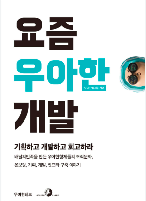
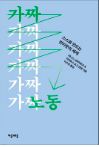
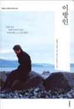
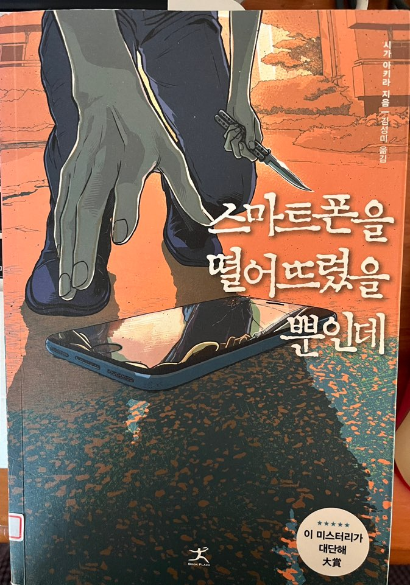
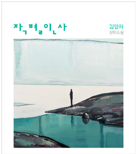

## About IT.

| **Cover**  | **Name**        | **Author**    | **Date Finished** | **Comment** |
|--------------|--------------|---------------|----------------|----------------------------------|
|                 | 요즘 우아한 개발             | 우아한형제들             | 2024년 2월 18일       | 우리의 일은 정답이 있는 것이 아니라 상황에 맞춰 선택하는 것이고, 그 선택이 최고의 선택이 되게 노력하는 것  |

## Etc,.

| **Cover**  | **Name**        | **Author**    | **Date Finished** | **Comment** |
|--------------|--------------|---------------|----------------|----------------------------------|
|                 | 가짜노동             | 데니스 뇌르마르크,아네르스 포그 옌센             | 2024년 3월 3일       | 공감할 수 있는 내용이 많다.  |
|                 | 이방인             | 알베르 카뮈             | 2024년 1월 13일       | 삶을 산다는 것 자체가 자신에게 이방인인 것  |
| {: width="50%" height="50%"}                 | 스마트폰을 떨어뜨렸을 뿐인데             | 시가 아키라             | 2024년 9월 18일       | 중요하다. 개인정보 |
|                 | 작별인사            | 김영하             | 2024년 9월 21일       | 나에 대한 완벽한 부정 |

                            