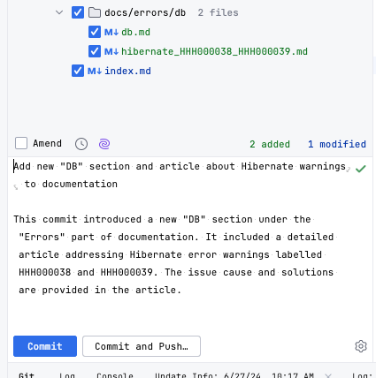

# background

- 매년 JetBrain 설문에 응답해왔지만 한번도 당첨된 적이 없었는데요.
- 올해도 반전없이 당첨되지 않았지만.. **AI Assistant Pro** 한달 사용권을 받았습니다 🤗
- 2번의 스프린트 기간동안 적극적으로 사용봤습니다.

# AI Assistant에 대해

## 0. 가격

- Pro버전 한달에 $8.33 달러로 세금까지 더하면 $10달러 약간 넘는 것으로 알고 있습니다.(24년 6월 기준)

## 1. 대표 기능

- AI 채팅
- 문서 및 커밋 메시지 작성
- 테스트 코드 생성
- 오류 설명 및 수정 제안
- 리팩토링
- 클래스, 함수 및 변수의 이름 제안
- 코드를 다른 언어로 변환
- Grazie 사용 +
    - Intellij AI pro사용자에게는 무료로 사용할 수 있습니다.(한시적인지 확인은 필요해보여요~!)
    - Grazie는 문법, 철자 등 문장교정 및 요약 해주는 플러그인입니다.

# AI Assistant 프로모션 코드 적용

- [AI 소개 페이지](https://www.jetbrains.com/ko-kr/ai/?utm_source=marketo&utm_medium=email&utm_campaign=general&utm_content=newsletter&mkt_tok=NDI2LVFWRC0xMTQAAAGS9jCNOPmbWX_8NgMoI1v4SZrwIU8p8lZ0cuZ1-M2YMAECj7hpF4swi7KvwGaqblaeRThAMKs2c1q--iYT2HIjFKwuyXimtw5Unq-wrMDyxLUp418&plan=individuals#plans-and-pricing) → [**지금 구매하기**] 클릭 → 결제화면에서 할인 코드 입력합니다.
- $0 달러임에도 신용카드 결제화면에 가서 결제해야해요.
- 결제되면 이메일로 라이선스가 오고
- Intellij 재시작하면 → Help → Register → AI Assistant에서 Active된 상태를 확인할 수 있습니다.
- Intellij에서 우측에서 아이콘을 누르고 [**Start Using AI Assistant**]를 클릭합니다.
    
    
    

- 사용 동의하고 나면 채팅할 수 있는 영역이 표시됩니다.
    - 간단하게 한글 지원이 가능한지 질답해봤는데요. 확실하게 지원한다고 합니다. ^__^
    
    
    

# AI Assistant 따라잡기

## 1. AI 채팅

- 코드를 복붙하지 않아도 intellij에 셋팅한 프로젝트안에 있는 파일명만 말하면 또는 열려있는 파일이 있다면 쉽게 질문할 수 있어서 무엇보다 편하네요.
- ai에 질문하면 셋팅한 프로젝트 자체가 외부에 저장되거나 유출될 가능성이 있는지 염려되어 물어봤습니다.
    - 다행히도 **로컬에 저장된 정보**만 사용한다고 하네요~!
    
    
    

## 2. Explain with AI 익셉션 도움말

- 익셉션이 로깅되면, **Explain with AI** 이 옆에 붙는데, 클릭하면 바로 AI Assistant 대화화면으로 이동해서 해당 익셉션에 대해 솔루션을 제공해줍니다.

## 3. code block을 drag해서 질문할수 있습니다

- 코드를 drag하고 → 왼쪽 형광등 tooltip 누르면 AI Actions 메뉴가 표시됩니다.
- 그 중 Suggest Refactoring을 선택하면 바로 리팩토링한 코드를 제시하고
- 해당 코드로 New Chat~을 통해 다른 질문을 할 수도 있습니다.
    
    
    
- See Diff And Apply누르면 compare한 코드를 표시합니다.
    
    
    
    - 동일 구조의 조건이 반복하고 있는 코드인데, 하나의 함수로 리팩토링되었습니다. 👍🏻

## 4. 커밋 코멘트도 생성해준다!

- 파일 변경사항을 보고 작성하는 것 같습니다.
- 내부적으로 jira issue 번호로 task branch를 생성하고 comment에도 작성해야하는 규칙이 있어서 사용할 수 없지만, jira 연계 설정이 되어있으면 jira 베이스로 내용 개선되면 좋을 것 같습니다.

## 5. 클래스 다이어그램도 그릴수 있을까?

- 결론은 그릴 수 없다. 🙅‍♂️

## 6. 번역

- 다국어 리소스 처리가 필요해서 번역을 요청했습니다.

- 결론은 할 수 읍다. 🙅‍♂️

# 결론

- 아무래도 인텔리제이에 셋팅된 프로젝트 내에서 질문하다보니, 코드를 질문에 붙여넣지 않아도 클래스명만 말해도 바로 원하는 답변을 얻을 수 있었는데요. 이게 가장 큰 장점인 것 같습니다.
- 제안한 코드와 diff 하는 기능은 특히 굳~!
- 앞으로도 많이 개선되어서 생산성을 올려주면 너무 좋을 것 같네요 😍
- (주의) 자동갱신되는 옵션을 off 해야합니다.

# Bug..😱

- 한글로 질문해도 new chat이나 다른 기능을 통해 질문하는 것에 대한 답변은 항상 영어로 먼저 답변해서 이점은 개선이 필요해보입니다.
    - intellij 로케일 설정을 바꿔서 해보면 다를 수 있겠습니다. 🤷‍♂️
- 가끔 코드라인과 설명라인이 바뀌어서 표시되기도 했습니다.
    
    
    

# Reference

- [jetbrains introducing-jetbrains-ai-and-the-in-ide-ai-assistant/](https://blog.jetbrains.com/ko/blog/2023/12/06/introducing-jetbrains-ai-and-the-in-ide-ai-assistant/)