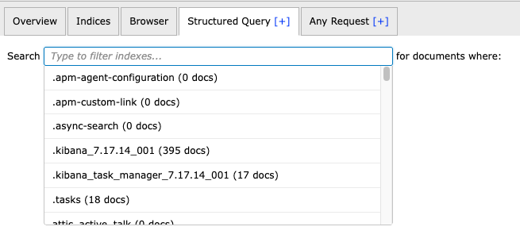

# 분석

역사?가 복잡하네요..

우선 Multi Elasticsearch Head 라는 이름이 붙여지기 이전부터 사용하고 있었는데,  

1. [https://github.com/lyfeyaj/elasticsearch-head-chrome](https://github.com/lyfeyaj/elasticsearch-head-chrome){:target="_blank"} 는 현재 private인것 같고
2. [https://github.com/mobz/elasticsearch-head](https://github.com/mobz/elasticsearch-head){:target="_blank"} 이건 이미 크롬 확장 프로그램에 없습니다.
3. [https://github.com/tradiff/elasticsearch-head-chrome](https://github.com/tradiff/elasticsearch-head-chrome){:target="_blank"}를 포크한것이 그다음 Multi Elasticsearch Head
4. Multi Elasticsearch Head은 [https://github.com/vorapoap/elasticsearch-head-chrome](https://github.com/vorapoap/elasticsearch-head-chrome){:target="_blank"}

결론은..현재는 어떤 브랜치도 활동이 없네요. 😭

# 요구사항

1. 멀티 테넌시용 필터 기능 추가
    1. 회사에서는 멀티 테넌시 개념으로 운영하다보니, Structured Query 탭에 document가 무한 스크롤이 되고 있어서 이 부분에 필터 기능 추가
2. Indices에서도 멀티 삭제가 가능하도록 기능 추가
3. Home 화면 > Refresh 기능 개선
    1. 현실성있는 주기로 변경하고
    2. 디자인이 일부 깨지는 것 수정했습니다.
4. ES 서버 삭제하는 - 버튼이 제대로 동작안하는 부분이 있어서 수정
5. 다국어 팩
    - 한국어 추가를 고려했지만, 제가 사용한다 생각하니 흠..불편할듯해서 추가하지 않았습니다.

# 작업순서

1. 나의 repo로 fork 뜨고
2. 나의 repo에서 develop 브랜치 따고
3. 로컬 환경 셋팅
    1. clone
    2. intellij 셋팅하고
    3. python으로 서비스 띄우기
    
    ```prolog
    cd /../elasticsearch-head-chrome && python3 -m http.server 8000
    ```
    
    1. 로컬 접속
        1. http://localhost:8000/elasticsearch-head/index.html
        2. 또는 maven install 후 크롬에서 개발자 도구로 등록해서 검증 가능합니다.

# 개발 (with cursor pro)

- 요즘 프로젝트도 그렇고, 구조 파악을 먼저 커서에게 요청합니다.
- 그리고 제가 설계방향을 정하고
- 다시 커서에게 설계방향에 맞게 가이드라인 코드를 작성요청합니다.
- 작성한 코드를 검증하면서, 하나씩 테스트를 진행합니다.
- 주석도 생성되는 문제..
    - 기존 코드에 주석이 있으면 주석을 자유로 생성하는 것 같네요.
    - 개인적으로는 주석은 되도록 지양하는 편이라 다 지워야했습니다.. (주석이 있으면, 시그니처와 리팩토링으로 클린코드되어있지 않다고 ..생각이…..)
- javascript로 하는거라 의외로 검증도 복잡하지 않았고, 코드리뷰도 빨리 끝난것 같습니다.

# 테스트

### 1. 테스트 실행

- 기존 히스토리에는 테스트 단계가 있었던 것 같은데.. fork한 브랜치에는 없어보인다. 이것도 TODO로 가져와야겠다.

### **2. 크롬 확장 프로그램으로 로드하기**

- 더 정확한 테스트를 위해서는 크롬 확장 프로그램으로 로드해서 검증이 필요하다.
- 방법
    - 프로젝트 maven install
    - 크롬 브라우저에서 chrome://extensions/ 접속
    - 우측 상단의 "개발자 모드" 토글 활성화
    - 프로젝트 폴더 선택


# PR..

- pr 요청했지만, 역시 답이 없네요. 😭

[https://github.com/vorapoap/elasticsearch-head-chrome/pull/3](https://github.com/vorapoap/elasticsearch-head-chrome/pull/3){:target="_blank"}

- 개인적으로는 release로 묶은 zip파일을 확장 프로그램으로 등록해서 사용중입니다.

# Screen Shot



# Github
- [elasticsearch-head-chrome](https://github.com/tnfhrnsss/elasticsearch-head-chrome){:target="_blank"}  