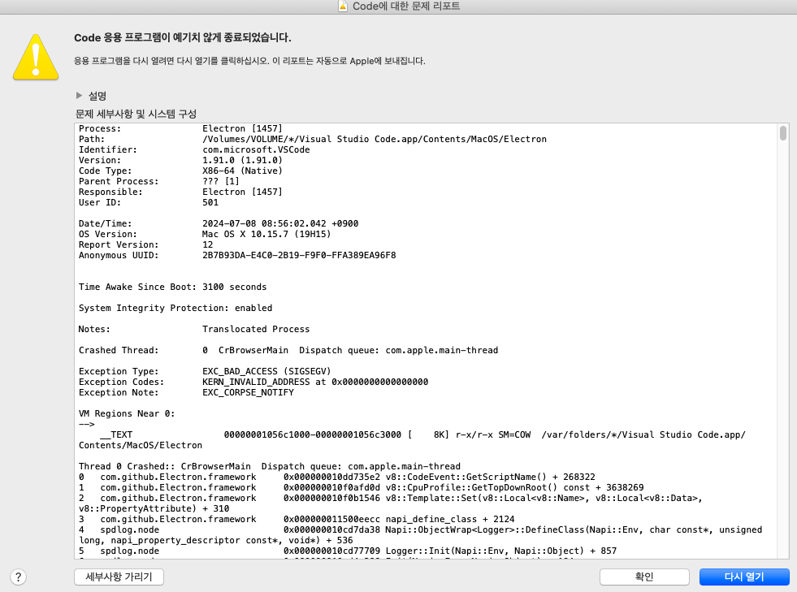

# Problem

- 잘 사용해오던 프로그램인데, 갑자기 구동이 안되는 현상이 발생했습니다.
- 에러같은 것도 없고, 프로그램 실행하면 구동 중 꺼지는 것 같은 느낌을 받았는데요.

# Try 1. reinstall

- 구글 검색해보면 다시 설치해서 덮으면 해결된 경우가 많은 것 같습니다.
- 저는 이 방법으로 해결되지 않았습니다.

# Try 2. code --verbose

- 구글 검색해보면 vscode로 명령어를 입력하면 해결된다고 했는데요.
- 저의 경우는 code란 명령어를 찾을 수 없다고 나와서 이것도 도움이 되지 않았네요.

# Try 3. chatGpt

- gpt에 물어보니 여러가지 방안을 제시해줍니다.

### 1) 로그 확인

- Command + Space를 눌러 Spotlight를 엽니다.
- "Console"을 입력하고 Enter를 눌러 Console 앱을 엽니다.
- "오류 보고서"나 "시스템 로그"를 확인하여 VS Code 관련 오류를 찾습니다.
    
    ```java
    Jul  8 08:27:16 peter com.apple.xpc.launchd[1] 
    (com.microsoft.VSCode.12872[1033]): Service exited due to SIGSEGV
    Jul  8 08:27:21 peter com.apple.xpc.launchd[1] 
    (com.apple.mdworker.shared.0B000000-0600-0000-0000-000000000000[1016]): 
    Service exited due to SIGKILL | sent by mds[114]
    ```
    
    - gpt에 따르면, 비정상 종료가 되었다고 하는데요.
        
        ```java
        로그에 따르면, Visual Studio Code가 SIGSEGV (Segmentation Fault) 신호로 인해 
        종료되었음을 나타내고 있습니다. 
        이는 메모리 접근 오류로 인해 프로그램이 비정상적으로 종료되었음을 의미합니다. 
        ```
        

### 2)  플러그인 문제 확인 및 비활성화

- 플러그인 문제일 수 있으니 모두 비활성화합니다.
    
    ```java
    code --disable-extensions
    ```
    
- 프로그램을 재시작했는데요. 여전히 구동되지 않네요.

### 3) 프로그램 삭제 및 vscode 관련해서도 다 삭제합니다.

- application, library, cache 등등에서 vscode 관련해서 찾고 삭제했습니다.
- 루트 path에서도 .vscode 폴더가 있어서 삭제했습니다.
- 그리고 프로그램 재시작했는데요. 아래와 같은 에러가 나타났습니다.




### 4) Electron 에러 - Process:   Electron [1457]

- gpt에 해당 에러를 물어보니 Electron 프레임워크와 관련된 문제일 수 있기 때문에 VS Code의 이전 버전을 설치해보라는 답변을 받았습니다.
    
    ```
    SIGSEGV 오류와 관련된 추가 로그를 제공해주셔서 감사합니다.
    로그를 보면 EXC_BAD_ACCESS (SIGSEGV)와 관련된 오류가 발생하고 있으며,
    이는 메모리 접근 문제를 나타냅니다. 
    제공된 로그에 따르면, Electron의 CrBrowserMain 스레드에서 문제가 
    발생한 것 같습니다. 
    ```
    

# Solved

- .vscode 폴더 및 기존에 설치했던 vs code를 제거하고
- [https://code.visualstudio.com/updates/v1_69](https://code.visualstudio.com/updates/v1_69) 에서 2022년 버전으로 다시 받아 설치하니 해결되었습니다. 😭
- 고맙다 지피티여-