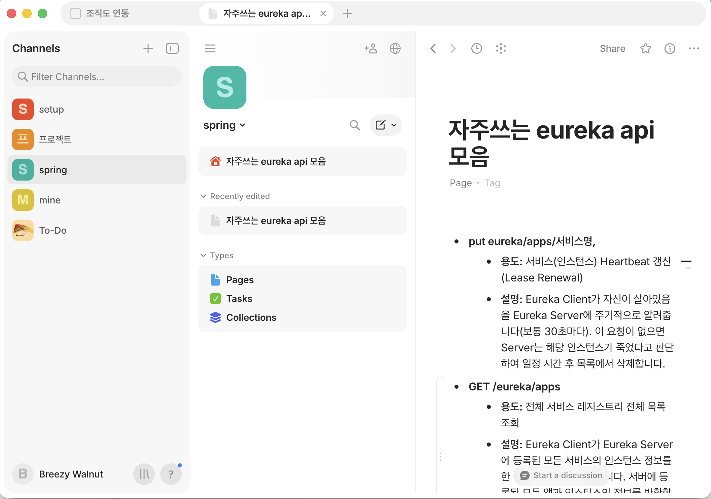

에버노트에서 노션으로 넘어온 지 몇 년이 지났습니다.
([importing evernote to notion](./importing_evernote.md))

그러다 올해 여름, 노션의 불편함을 못 견디고 **Anytype**으로 갈아탔습니다.
그리고 3개월 만에 다시 노션으로 돌아왔습니다.

나름 사용 후기를 정리해봤습니다. ☺️

참고로 노션은 미국 회사(Notion Labs)이고, Anytype은 스위스 협회(Any Association)가 주체이며 개발팀은 베를린에 있습니다.
특정 회사의 소유가 아닌 구조라는 점이, 로컬 우선(local-first) 철학과 맞닿아 있는 것 같습니다.

---

## 왜 Anytype으로 갔었나

AI기능을 붙인 노션이 점점 **무거워진다**는 느낌 때문이었습니다.

기능은 계속 늘어나는데 제가 쓰는 건 그중 일부고,
모바일에서는 한 페이지에 내용이 많으면 스크롤할 때마다 페이지가 다시 로딩되는 일이 반복됐습니다.
무한 로딩에 걸린 것처럼요. (지금도 수정되었는지 모르겠습니다..)

그래서 대체 프로그램 검색 중에 가볍다는 Anytype이 괜찮아보였습니다.

---

## Anytype이 불편했던 점

### 1. 정보가 유실된다 (동기화)

가장 치명적이었습니다.

회사 PC에서 적은 내용이 집 PC에서 안 보이는 경우가 많았고, 반대도 마찬가지였습니다.
"어? 이거 분명히 저장시켰는데.." 를 몇 번 겪고 나니, 불편함이 커진것 같습니다.

아무래도 개발하다가 남기게 되면, 로그나 꼭 체크해야할것들을 위주로 기록하기도 하는데, 
정합성?이 떨어지니 신뢰를 못하게되었습니다.

### 2. 한글 검색이 잘 안 된다

한글로 검색하면 분명히 있는 문서가 안 나옵니다.
결국 **검색은 포기하고** 트리를 직접 타고 들어가서 찾게 되더군요.

몇 년치 노트가 쌓인 사람에게 검색 포기는 꽤 큰 손해입니다.

### 3. 복사/붙여넣기가 불편하다

제목 아래 하위 항목까지 통째로 복사가 안 되고, 같은 뎁스로만 붙여넣어집니다.
계층 구조를 그대로 옮기고 싶은데 그게 안 되니 매번 손으로 정리해야 했습니다.

중간에 버전업하고 났을때는 더 심각한 버그가 있었는데요. 다행히 그건 수정되었습니다.

### 4. 잔버그가 많다

큰 버그는 아닌데 자잘한 버그가 계속 보입니다.
예를 들면 
- 백스페이스를 아무리 눌러도, 삭제가 안되는 현상이 하루에도 몇번씩 발생합니다.
- 개행할때마다, 개행과 다르게 전체 행이 무한 증식되는 현상이 있습니다. 😭

### 5. 결국, 불편함이 쌓인다

그게 쌓이고 쌓이다가 어느 순간 임계점을 넘었습니다.
3개월이면 나름 오래 참고 쓴 것 같습니다.

---

## 그래도 Anytype이 좋았던 점

### 모바일이 가볍다

노션에서 가장 짜증났던 **긴 페이지 리로딩이 없습니다.**
내용이 많아도 스크롤이 끊기지 않습니다. 이건 확실히 Anytype이 낫습니다.

### 메뉴 구성이 좋다

채널 아래에 page와 task를 나눠서 둘 수 있는 구조가 마음에 들었습니다.

{: width="70%" height="70%"}

이런 식으로 잘 쓰고 있었습니다.

노션에서는 이걸 데이터베이스와 속성으로 직접 만들어야 하는데, Anytype은 기본 구조가 그렇게 잡혀 있습니다.

### 라이트하다

노션이 **투머치**라면 Anytype은 딱 필요한 만큼입니다.
이 가벼움은 정말 좋았습니다. 버그만 없었다면요.

---

## 노션도 완벽하진 않다

- **AI 기능이 갑자기 튀어나옵니다.** 글 쓰다가 원하지 않는 순간에 끼어드는 게 제일 불편합니다.
- 모바일 긴 페이지 리로딩은 여전합니다.
- 노션도 버그는 보입니다.

기능을 엄청 잘 쓰는 편은 아니지만, 몇 년간 굳어진 방식이 있는데
Anytype에서는 그 패턴이 잘 안 돌아갔습니다.

---

## 정리

| 항목 | Notion | Anytype |
|------|--------|---------|
| 동기화 신뢰도 | 안정적 | 기기 간 누락 발생 |
| 한글 검색 | 잘 됨 | 거의 포기 |
| 복사/붙여넣기 | 계층 그대로 복사 | 같은 뎁스로만 |
| 모바일 긴 문서 | 리로딩 반복 | 쾌적함 |
| 메뉴 구조 | 직접 설계해야 함 | page/task 기본 제공 |
| 기능 범위 | 투머치 | 라이트 |
| 안정성 | 무난 | 잔버그 많음 |

---

## 마치며

앞으로 더 좋은 도구가 나오면 또 갈아탈 생각이 있습니다.
클로드로 만들까 했지만, 아직은 에디터?프로그램을 만드는건 쉽지않겠다라는 생각이 들었습니다..

결국 제가 도구에 바라는 건 하나뿐이더군요. **적어둔 게 그대로 남아 있을 것.**

저는 정리를 잘하는 타입이라기보다 머릿속에 있는 걸 어딘가에 동기화해둬야 안심이 되는 쪽인데,
Anytype은 딱 거기서 걸렸습니다.

그래서 당분간은 다시 노션과 함께 가보려고 합니다. ☺️
