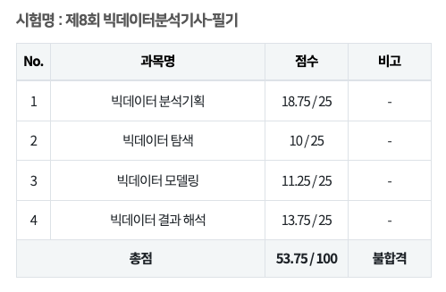

2024년 4월에 도전한 빅데이터 분석기사 필기 불합격 수기입니다.

# 시험 결과

# 후기

- 평온하게 정리하면 “**불합격**”이고  전혀 아쉽지 않은 53.75입니다 ㅜㅠ
- 60점이 커트라인이지만 53.75도 놀라운 결과 😲
- 시험 결석자가 많다는 후기를 봤지만 제가 봤던 시험장은 많은 사람들이 출석해서 시험을 봤습니다.

# 시험 유형

- 문제은행으로 된 시험이 아니기 때문에 전반적으로 흐름을 이해하고 상세하게 외워가는게 중요합니다.
- 저는 디테일에 실패했네요 ;ㅁ;

# 학습 방법 🤣

- 불합격한 사람의 학습방법은 참고할 필요가 없겠지만…
- 교재를 한권 구매했습니다.
- 1과목을 제외하고 교재만으로 이해되지 않아서  유튜브 검색해서 강의를 들었는데 그나마 도움이 되었습니다.
- 출제유형이 감이 오지 않아서 블로그를 많이 검색했습니다.
- 1과목은 반복해서 보고 암기하면 되는데.  it종사자한텐 가장 쉬운 과목일 것 같습니다.
- 계산해야하는 문제는 특정되어있어서 따로 정리해두면 득점이 어렵지 않습니다. (불합격했지만 ㅋㅋ)