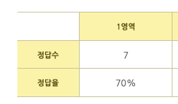

# 전형 후기

- 그나마 1과목, 4과목 덕분에 겨우 겨우 턱걸이로 합격했습니다. 😆
- 1과목만 캡쳐
    
    
    
- 시험 시간은 마킹하기에도 시간이 부족했습니다. (마지막 10분 남기고 불꽃 마킹..)
    - 더블 체크하려고 했던 문제들도 대부분 처음 선택했던 답안으로 낼 수 밖에 없었네요. ㅜㅠ
- 그리고 무엇보다 일단 전형료가 비싸요. 13만원이였던가(충격에 가물가물)..
    - 단체로 하면 약간 저렴하게 가능하다고 합니다.
- 1회독만 더 했으면.. 하는 아쉬움이 있었습니다.
- 하지만 결과적으로 운이 좋았던것 같습니다. 👍🏻

# 시험 준비

- 교재는 **2025 원큐패스 개인정보관리사 CPPG**로 구매했습니다.
    - 교재에 있는 시험문제는 모두 풀었습니다. 꼭 풀어보세요.  ‼️
- 학습기간은
    - 교재를 8월 4일에 구매하고,
    - 24일에 시험봤으니까
    - 총 **20일** 동안 준비했네요! 🤭
- 주로 활용한 시간은
    - 출근길 지하철에서..
    - 퇴근 후 2~4시간
    - 주말은 12~14시간 (실제 집중한 시간은 6시간 정도.. 🤮)
    - 시험 전 2일은 연차

# 학습 방법

- 정석 학습법은..
    - [https://rubywind.tistory.com/118](https://rubywind.tistory.com/118){:target="_blank"} 이거 인것같습니다.
- 하지만 저는..
- 매일 학습하긴 했지만, 주로 ‘3일내에 1과목 1회독한다’. 이런식으로 반복하면서 1회독 시간을 좁히는 것을 목표로 했습니다.
    - 시험 2일 전에는 과목별 1회독 시간이 대략 3~4시간 걸린것 같습니다.
    - 유튜브나 다른 개별법령을 볼 시간이 부족해서, 교재만 외웠습니다.
- 과목별 배점이 달라서, 1, 5과목 과락에 주의하라는 글을 읽고 집중 공략하긴 했습니다.
    - 제일 난해했지만,
    - 외우다 보면, 경향이 보일것 같다는 생각에 그냥 몽땅 외우기했습니다.
- 숫자 관련된 법령은 별도로 정리했더니 대략 5페이지 정도 분량이 나오더군요.
    - 모으고 보니, 헷갈렸던 부분이 많이 정리가 되었습니다.
    - 본법과 시행령이 구분되어 암기도 되고,
    - 악필이지만..그중 한 페이지 첨부하면
        
        {: width="50%" height="50%"}
        
    - 암튼 이렇게 정리를 한 부분에서 문제가 많이 출제되어 다행이였습니다.
- 집중 안될 때마다 전형료 충격요법으로 두눈 부릅뜨고 공부했던 것 같습니다. 🥊