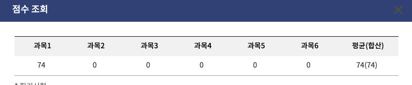

# 합격 후기

- 3번만에 합격했습니다. 😭
- 이번엔 주관식에 답변을 다 채울수 있었습니다.(오답도 있긴했지만)
- 다행히 난이도가 다른 회차에 비해 높지 않았던 것같습니다.
- 아 그리고 시험 접수하는게 의외로 동시접속자수때문에 쉽지않습니다. 겨우 **8번**?만에 접수할수 있었어요. 이게 제일 긴장되는 순간이였네요..💦

# 3번의 시험을 보기까지..
## 25년 2회 실기
- 필기 합격 후 바로 교재사고 본거라, 시간이 부족했었습니다. (기출도 몇 문제밖에 못보고 시험본것같아요.ㅜㅠ)  
    -> 결과는 **45점**

## 25년 4회 실기
- 이번엔 교재를 5회독 넘게 공부했지만 -> 결과는 **56점**
- 시험을 보고 나왔는데, 아무리 생각해도 제가 모르는 것들이 시험에 많이 나왔다는 생각이 들어서 합격수기를 찾기 시작했고.
    - 그래서 [카카오 오픈채팅방](https://open.kakao.com/o/gSF0ceIb) 에 들어가보니, 합격자들이 공부한 교재는 다르다는 것을 알았습니다.

## 26년 2회 실기
- 1회는 26년 개정판이 나오기 전이라 안보고, 알기사 2026년을 구매해서 2회 시험을 목표로 3월 말부터 책을 보기시작했습니다.
- 확실히 교재가 달랐습니다. 
- 최종 **74점**을 맞을 수 있었습니다. 🥳

    

# 학습방법
- 이번 2회차 학습기간은 2개월 반 정도인 것같아요. 
- 역시나 출퇴근 시간을 활용했고, 주말에도 계속 달렸습니다. 
- **(매우 중요)** 실기는 필기와 다르게 그냥 알고 넘어가면 안되고, 글로 쓰거나 구두로 설명할수 있을 정도로 이해하고 있어야 합니다. 
- 총 **10회**독은 넘게 한 것 같습니다. (기출도 별도로 3회독은 했습니다.)
- 중요한건 반복해서 기출을 보다보면, 대충 서술형과 단답식의 패턴이 보이기 시작합니다.
- 그리고 별도로 요점이나 오답 정리는 하지 않았습니다.
- 주관식 배점이 크다보니, 주관식 하나 틀리면 굉장히 타격이 크기 때문에 정확하게 알고 넘어가는거에 집착했었습니다.