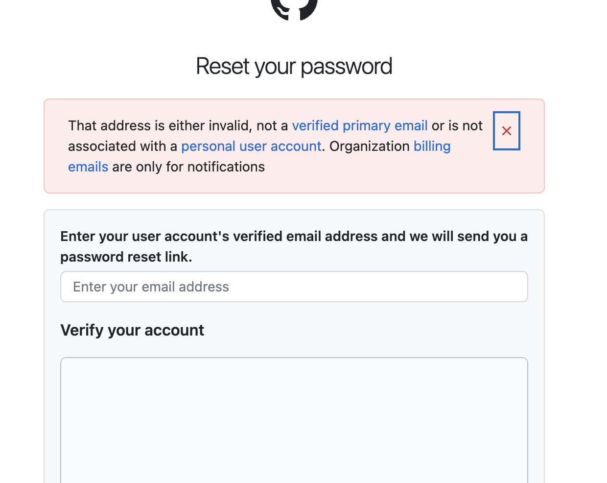

결론부터 말하면 저는 최초 접수한 이후에 **13일** 지나서 회신을 받을 수 있었고 

상담사 지원을 받아서 문제상황이 해결되었습니다.

| request history | • 1/3 최초 접수
• 1/4 다시 접수
• 1/6 추가 설명하고자 접수하고 받은 메일에 회신
• 1/11 다시 접수
• 1/11 다른 계정 정보로 재차 접수 |
| --- | --- |
| response history | • 1/16 최초 응답
• 1/17, 1/18일에 거쳐서 메일 주고받으며 해결 |

# problem

- 십년전에 회사 이메일 주소로 가입해서 동료와 스터디를 했었는데요. 이번에 회사에서 gitlab에서 github으로 변경하면서 문제가 생겼습니다.
- 비밀번호를 잊어서 로그인도 못하는 상황에 reset password하면 아래와 같은 메시지가 나오면서 이도저도 못하는 상황이 발생했습니다.
    
    ```yaml
    That address is either invalid, not a verified primary email or is 
    not associated with a personal user account. 
    Organization billing emails are only for notifications.
    ```

    
    

# Detail Request

- 1/3일 github support에 문의 접수합니다.
    - 비회원 접수로 진행하다보니, 티켓아이디는 알고 있었지만, 진행상황을 알 길이 없어서 답답..
- 1/4일 github support에 다시 문의 접수합니다.
    - 정보를 제대로 입력하지 못한 것 같아서 다시 제대로 입력해서 username과 email주소를 다시 적어 보냈습니다.
- 1/6일 3일에 수신받은 접수 완료 메일에 회신했습니다.
    - 상황을 좀 더 디테일하게 설명하기 위해 3일에 받았던 접수완료 메일에 회신을 했습니다.
- 1/11일 일주일이 지나도 회신이 없어서 다시 github support에 문의 접수했습니다.
    - 그리고 제가 사용하던 다른 계정으로 로그인해서 그 계정으로 동일 문의를 접수했습니다.
    - 이쯤되니, 블랙컨슈머 된 느낌이네요 ㅎㅎ

# Response

- 1/16 최초 응답이 왔습니다.
    - username과 email주소가 제 소유라는 확신할 수 없기 때문에, 등록된 다른 이메일 주소로 비밀번호 재설정 링크를 전송해준다는 것이였는데요.
- 1/17
    - 다른 이메일조차 삭제된 이메일이라 더 이상 비밀번호 초기화 진행이 불가능했습니다.
- 1/18
    - username에서 해당 회사 이메일 주소 연결을 해제시키는 작업을 통해 다른 계정으로 가입이 가능하도록 진행해줬습니다.

# summary

- [https://github.com/orgs/community/discussions/23989](https://github.com/orgs/community/discussions/23989) 에도 알 수 있듯이 github support는 느린편입니다.
- 그래도 한번 응답받으면 전담 상담사와 메일로 주고받으면서 해결할 수 있습니다.
- 스팸으로 빠지진 않았는지도 확인이 필요합니다!