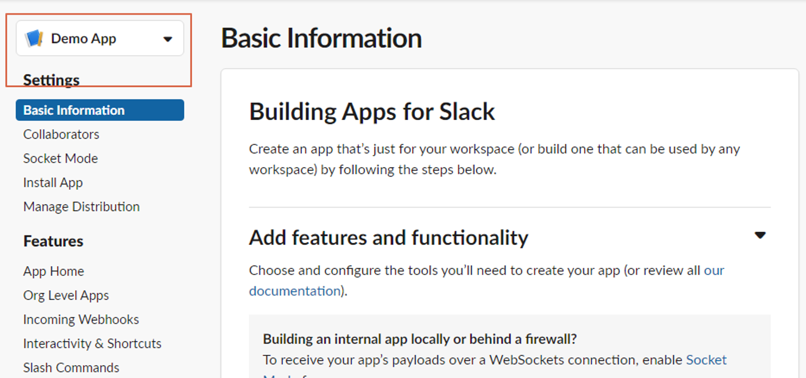
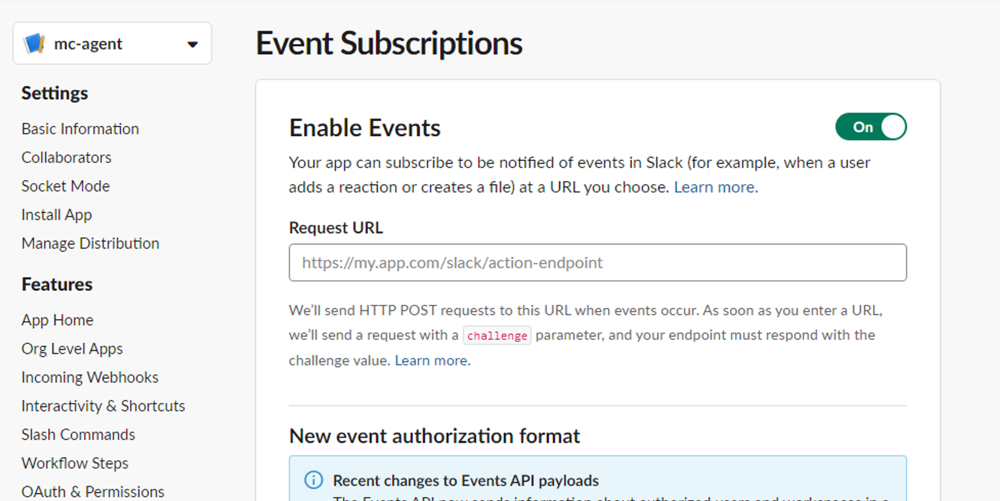
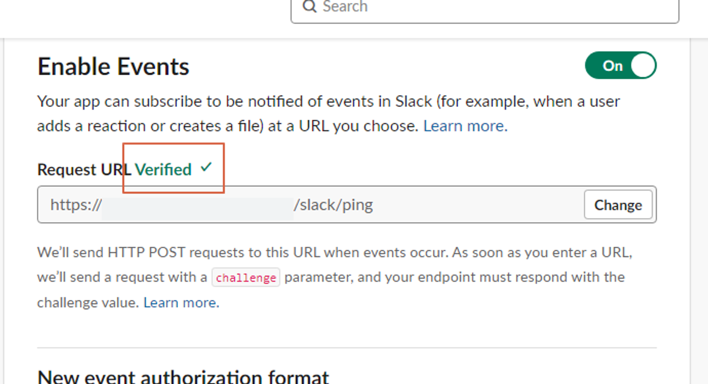
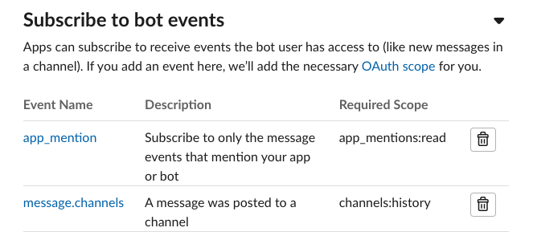

## Step 1. create workspace

- 테스트하기 위한 workspace를 생성합니다.

## Step 2. create App

- [https://api.slack.com/apps](https://api.slack.com/apps?new_app=1){:target="_blank"}에서 [Create New App] 선택
- **from an app manifest**를 선택하고 앱을 연결할 workspace 선택하고 생성
- 이름을 지정하지 않았으면 Demo App이란 이름으로 생성됩니다. (이름 변경가능합니다.)



## **Step 3.** 메시지 수신

### 1안) Webhook 메시지 이벤트 수신

- 슬랙 채널에 메시지를 받으면 이벤트를 통해 메시지를 수신받을 수 있습니다.
- 공인IP를 통해 메시지를 받을 수 있는 환경인 경우에만 가능합니다. (공인망에서 라우팅받거나, 로컬pc에 공인ip설정하거나)
- 순서1. 헬스체크용 endpoint 작성
    - 슬랙이벤트를 실시간으로 받기 위해서는 health check용 end-point를 작성해서 수신받은 슬랙 데이터 중 challenge 값을 리턴해야합니다.



- 컨트롤러 코드 예시

```java
// sdo
public class SlackHealthCheckSdo implements JsonSerializable {
   private String token;

   private String challenge;

   private String type;

   @Override
   public String toString() {
       return toJson();
   }
}

// controller
@Slf4j
@RestController
@RequiredArgsConstructor
@RequestMapping("slack")
public class SlackMessageController {
   private final SlackSourceMessageFlowService slackSourceMessageFlowService;

   @PostMapping("ping")
   public String ping(@Valid @RequestBody SlackHealthCheckSdo slackHealthCheckSdo) {
       log.debug("slack healthcheck : {} ", slackHealthCheckSdo);
       return slackHealthCheckSdo.getChallenge();
   }
}
```

- 순서2. 슬랙 App 설정
    - App 설정 화면 -> Features -> Event Subscriptions 메뉴로 이동합니다.
    - Enable Events를 on으로 변경합니다.
    - Request URL에 위에서 작성한 end-point를 넣고 Verified 확인받습니다.
    - 



- 순서3. 메시지 이벤트 수신 **/slack**  API 작성
    - 메시지 수신을 위한 endpoint를 “/slack” 으로 해서 추가 작성합니다.
    - 해당 App이 설치된 슬랙 workspace의 채널로 이동해서 메시지를 입력하고 메시지가 들어오는지 확인합니다.
    - 슬랙으로 전송한 메시지가 다시 이벤트로 수신되기 때문에, user정보가 널인지 체크해서 봇 메시지는 제외시켜야 합니다.
    
    ```java
    // sdo
    public class SlackMessageSdo implements JsonSerializable {
       private String token;
    
       private SlackEvent event;
    
       private String event_ts;
    
       @Override
       public String toString() {
           return toJson();
       }
    
       public boolean hasUserMessage() {
           return StringUtils.isNotEmpty(this.event.getUser());
       }
    }
     
    
    // controller
    @PostMapping
    public void messages(@Valid @RequestBody SlackMessageSdo slackMessageSdo) {
       log.debug("messages : {} ", slackMessageSdo);
       slackSourceMessageFlowService.message(slackMessageSdo);
    }
    ```

- 순서4. Subscribe to bot or user events 설정
   - 수신받고자 하는 이벤트를 추가합니다.
   - 만약에 사용자가 입력하는 메시지 이벤트를 수신하려면, message.channels와 app_mention를 추가합니다.
   


- 순서5. 앱 reinstall
   - 앱을 재설치합니다.
   - 워크스페이스 화면으로 이동해서 앱 설치할때 선택한 채널로 봇을 추가합니다.
    

### 2안) 주기적 폴링 방식으로 메시지 수신

- 배치를 통해서 주기적으로 슬랙 API를 통해 채널에 입력된 메시지를 읽어옵니다.
- 순서1. App 권한설정
    - Features -> OAuth & Permissions 메뉴를 선택합니다.
    - 스크롤 내리면 Scope 항목이 보입니다.
    - Scope중 Bot Token Scopes에서 channels:read 권한을 추가합니다.
- 순서2. slack client api 코드 작성
    - slack client api dependency를 추가합니다.
- 순서3. conversations.history API를 배치를 통해 주기적으로 호출
    - parameter: 대화 내용을 조회할 채널의 ID
    - header : App 토큰
    - body : 채널 ID

```bash
curl --location --request GET 'https://slack.com/api/conversations.history?channel={channelId}' \
--header 'Content-Type: application/json' \
--header 'Authorization: Bearer {token}' \
--data '{
  "channel": {channelId}
}'
```

## Error

- chat.postMessage 할 때 missing_charset error
    
    ```xml
    {
        "ok": false,
        "error": "not_in_channel",
        "warning": "missing_charset",
        "response_metadata": {
            "warnings": [
                "missing_charset"
            ]
        }
    }
    ```
    
    → Content-type을 application/json; charset=utf-8 으로 실행시켜야한다.
    

- “not_in_channel” error
    - 슬랙에서 해당앱을 특정 채널에 연결해야한다. 아님 join api써서 연결
    
- missing_scope error
    - 권한을 추가하고도 계속   “missing_scope” 에러로 리턴된다면, reinstall_app을 실행해주는 것이 좋다. (웹콘솔화면에서 실행)

## Reference

- [https://api.slack.com/messaging/retrieving](https://api.slack.com/messaging/retrieving){:target="_blank"}
- [https://api.slack.com/apis/connections/events-api](https://api.slack.com/apis/connections/events-api){:target="_blank"}