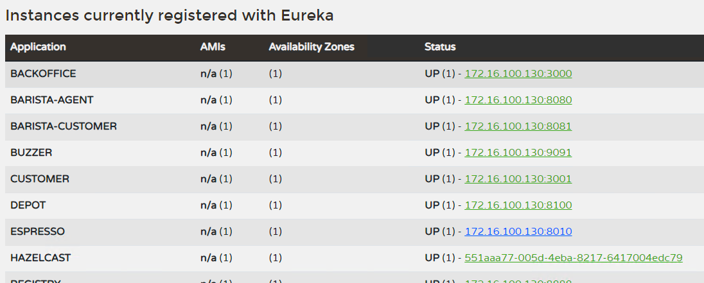

# Hazelcast network config

- hazelcast.xml에서 network 설정을 할 수 있는데요.
- 그 중 join할 수 있도록 Auto Detection, Multicast, **TCP**/**IP**, AWS, Kubernetes, Azure, GCP, **Eureka** 등등의 방식을 제공합니다.

# Eureka

- eureka 방식으로 하면 registry가 완전히 기동되어야 hazelcast를 띄울수 있는 제약이 있습니다.
    - 그래야 eureka에 hazelcast도 인스턴스로 등록되면서, 자동으로 discovery될 수 있습니다.

    
    
    - 하지만 eureka에 의존성이 있어서 서비스 운영할 때 고려할 부분이 됩니다.
    
    ```xml
    <network>
        <join>
            <multicast enabled="false"/>
            <eureka enabled="true">
                <self-registration>true</self-registration>
                <namespace>hazelcast</namespace>
                <use-classpath-eureka-client-props>false</use-classpath-eureka-client-props>
                <shouldUseDns>false</shouldUseDns>
                <name>hazelcast</name>
                <serviceUrl.default>http://172.16.100.130:8888/eureka</serviceUrl.default>
            </eureka>
        </join>
        <rest-api enabled="true">
            <endpoint-group name="HEALTH_CHECK" enabled="true"/>
            <endpoint-group name="CLUSTER_READ" enabled="false"/>
        </rest-api>
    </network>
    ```
    

# **TCP**/**IP**

- 멀티 캐스트를 사용할 수 없는 환경에서 TCP 기반의 통신을 통해 Hazelcast 클러스터를 구성할 수 있습니다.
- 이는 멀티캐스트에 비해 더 간단하고 확장 가능한 방식입니다.
- 그리고 이렇게 구성하면 Eureka에 등록되지 않아서, 목록에 노출되지 않습니다.

```xml
<hazelcast ...>
    ...
    <network>
        <join>
            <tcp-ip enabled="true">
                <members>192.168.0.1,192.168.0.2,192.168.0.3</members>
            </tcp-ip>
            <multicast enabled="false"/>
            <eureka enabled="false">
                ...
            </eureka>
        </join>
        ...
    </network>
    ...
</hazelcast>
```

# Reference

[https://sarc.io/index.php/miscellaneous/968-hazelcast-multicast-tcp-ip-cluster](https://sarc.io/index.php/miscellaneous/968-hazelcast-multicast-tcp-ip-cluster)

[https://docs.hazelcast.com/hazelcast/5.3/clusters/network-configuration](https://docs.hazelcast.com/hazelcast/5.3/clusters/network-configuration)