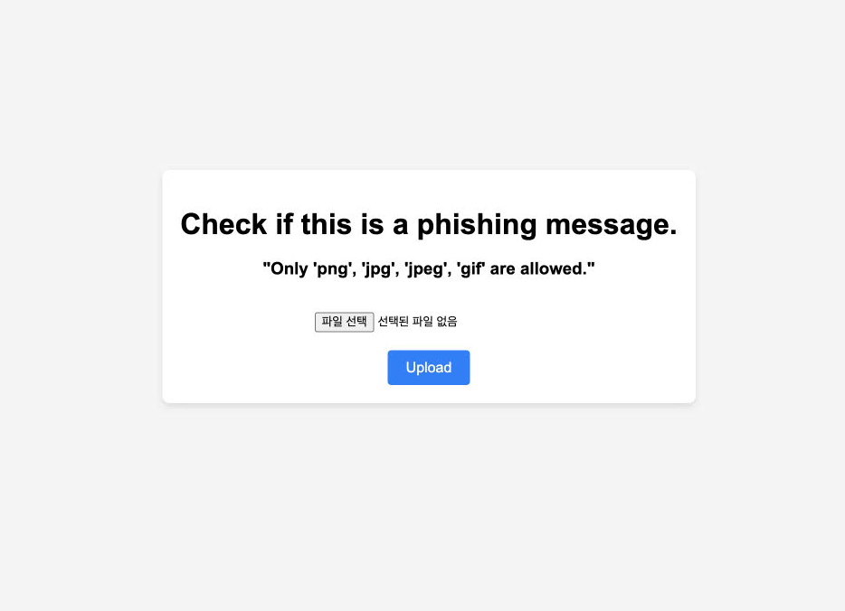

 

어제 [Winner](https://ai.google.dev/competition?utm_source=gadc&utm_medium=email&hl=ko){:target="_blank"} 발표도 있기도 해서,

우승자들 작품도 보면서 ..감탄하면서..

올 여름에 진행되었던 **Gemini API Developer Competition**에 참여한 후기를 정리했습니다.

# 소감

- 마감일 앞두고 며칠 동안 잠을 제대로 못자고 개발했지만, 수상을 노리기엔 턱없이 부족했습니다.
- 기간 내에 동영상까지 유튜브로 올리고 제출할 수 있었던 것에 만족합니다. 🤗 ..
- 이번 참여를 통해서 처음으로 google cloud에 서비스를 올려봤는데요. 쉽지 않았습니다… (별도 포스팅으로 정리하고 있습니다.)
    - 특히나 파이썬은 용량이 커서, 이 부분을 줄여서 비용을 감소시키는 것이 쟁점입니다!!
- 제출 후에도 리팩토링 및 기능 개선하려고 했지만 그러지 못했네요 ㅜㅡ

# 계획 수립 🗓️

- 아이디어 구상
- 분석
- 설계
- 구현 및 테스트
- 데모 영상 만들기(유튜브 업로드)

# 아이디어 구상

- 무엇을 만들지, 어떤 서비스를 제공할지가 제일 고민이였습니다.
- 이 기간이 제일 오래걸렸어요 😭
- 친환경적인 서비스를 만들고 싶었는데요. 아직은 기술제약이 많네요.

# 기술 선택

아래의 카테고리 중 일부를 활용해야 하는 조건이 있었습니다.

앱은 꼭 스토어에 등록되지 않아도 됩니다.

python 또는 node.js와 같은 다른 형식으로 제출해도 되었습니다.

gemini api를 사용해야합니다.

- arcore 활용
- 웹앱
- 게임앱
- flutter
- 안드로이드
- firebase
- 크롬, 웹

# Eumang

## 1. 앱 소개

- 피싱 문자를 캡쳐해서 업로드하면 피싱여부를 판단할 수 있는 서비스를 제공한다.

## 2. 구현

- 웹서비스
    - python, flask 사용해서 웹서비스 구현
- 피싱여부 판독 기능
    - 일배치 판독 사전을 만든다.
    - 구글에서 피싱 이미지 수집
    - 이미지에서 문자를 추출
    - gemini api를 통해 해당 문자가 피싱에 해당하는지 체크한다.
    - 피싱에 해당할 경우와 아닌 경우는 1,0으로 만든다.

# 데모 영상

데모 영상 만들기

- 3분 이내의 것
- 설명보다 어떻게 동작하는지를 보여준다.
- 창의력있는 영상이면 가산점준다.
- gemini api가 어떻게 적용되어 기능하는지를 보여줘야한다.
- 유튜브 영상으로 올려서 url로 제공한다.( 이때 #buildwithgemini 해시태그 붙인다)

# Apply

- github
    - 반드시 github repository에 공개된 상태여야한다.
- google cloud 서비스 등록
- 앱이 있다면, 스토어에 등록해서 사용성을 받는것도 좋은 점수얻을 수 있을 것 같다.