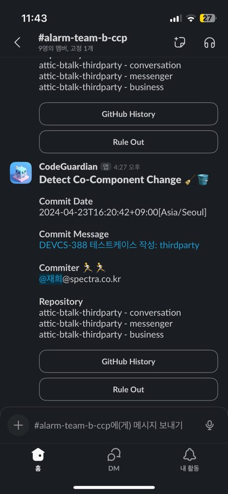

# 배경

- 클린 코드 활동을 하자.
- ccp를 위반한 코드를 발견해서 개선하는 활동을 OKR 목표로 설정하고 이를 스프린트마다 체크해서 수치화해야 한다.
- 자주 변경되는 리파지토리 및 컴포넌트에 대해 코드간 연관 규칙을 발견하고 리팩토링 포인트를 도출할 수 있도록 한다.
- 궁극적으로 이러한 활동을 통해 모듈간 응집도를 높이고 유지보수를 쉽게 할 수 있도록 한다.

## CCP(Common Closure Principle)란?

- 마틴파울러
    - 공통 폐쇄 원칙에 따르면 동일한 이유로 동시에 변경되는 클래스는 구성 요소로 수집되어야 하며, 서로 다른 시간과 다른 이유로 변경되는 클래스는 서로 다른 구성 요소로 분리되어야 한다.(MARTIN, 2017).
- SRP와 CCP
    - 코드를 변경은 하나의 component에서만 발생하는 것이 SRP에도 일치하게 된다.
    - 구현할 때 항상 동시에 변경이 발생하는 component가 존재한다면 동일 묶음? boundary 범위 (또는 component 그룹 또는 동일 레벨의 구성으로)안에 묶이게 해야한다.
- OCP와 CCP
    - 만약에 동시에 변경이 일어나는 여러개의 component가 존재한다면 하나로 통합해서 변경범위를 제한하게 하고 개방과 폐쇄를 지키게 할 수 있게 한다.
- CRP와 CCP
    - 동시에 재사용되는 클래스나 모듈이 존재한다면 동일 component에 속한다고 볼 수 있다.
    - 반대로 재사용이 되지 않지만 종속성을 갖고 있어서 불필요한 변경이 동시에 일어난다면 릴리즈도 불필요하게 발생하게 되므로 이것도 CCP위반 대상이라고 볼 수 있다.

# 검출 기준

## 1. Co-Change

- 한 개를 초과하는 리포지토리에 동시에 코드 변경이 발생한 경우를 의미한다.
- 기준
    - 동일 일자에 동일 커밋터가 동일 TASK를 작업
        - 동시의 기준은 동일 task에 대해서만을 대상으로 한다.즉, 동일 task에 대해 여러 일자에 거쳐서 여러명이 작업을 진행해도 측정 대상으로 한다.
    - 의존성을 갖고 있지 않더라도 업스트림에 해당하는 저장소에 변경이 일어난다면, 유기적 관계에 놓여있는 저장소도 변경이 발생하게 된다.
- 예외 상황
    - share 리파지토리에 발생한 변경에 따른 영향으로 발생하는 대응개발
        - → 다른 리파지토리와 자주 변경된다면, 공통이 아닌 개별 구현으로 고민할 수 있도록 한다.
    - 보안, 성능 등 비기능 요구사항 작업은 여러 저장소에 걸쳐 작업이 진행될 가능성이 높다.

## 2. Co-Component-Change

- 한 개를 초과하는 컴포넌트에 동시에 변경이 일어나는 경우를 의미한다.
- 기준
    - 동일 일자에 동일 커밋터가 동일 TASK를 작업했을 때, 한개를 초과하는 컴포넌트에 변경이 발생한 경우
    - co-change와 마찬가지로 동시의 기준은 동일 task에 대해서만을 대상으로 한다.즉, 동일 task에 대해 여러 일자에 거쳐서 여러명이 작업을 진행해도 측정 대상으로 한다.
    - 저장소별로 측정 레벨은 5레벨로 한다.
- 예외 상황
    - core영역의 kafka이벤트 모델에 변경이 일어났을 때, 여러 컴포넌트에 대응개발이 필요하다.

# 작업 내용

## 1. 수집

- 대상 리파지토리들의 develop branch를 near realtime으로 Github의 commit API를 사용해서 커밋 내역을 조회한다.
    - main에 pull request하기 전에 코드리뷰를 선행하는 효과가 있음 👽

## 2. 커밋 로그 적재

- github에 푸시할때 작성하는 jira task 번호를 key로 추출하고, 변경된 repository 및 컴포넌트를 redis에 캐시로 적재한다.
    - commit log 예시
        
        ```java
        ATDEF-1234 메시지 전송 오류 수정
        ```
        
    - redis 적용 방법은 별도 페이지로 포스트했다. ([https://tnfhrnsss.github.io/docs/msa/cache/redis_with_spring_boot_application/](https://tnfhrnsss.github.io/docs/msa/cache/redis_with_spring_boot_application/))
- cp 와 ccp 두개의 캐시로 저장 관리한다.

## 3. 캐시 분석

- 적재된 캐시를 분석해서 CCP 위반 조건에 해당하는지 판단한다.
- cp : 타스크에 1개를 초과하는 리파지토리가 있는지
- ccp : 타스크에 1개를 초과하는 컴포넌트가 있는지

## 4. 위반 알림

- 검출 대상에 대해서는 슬랙 API를 활용해서 CCP 채널에 전송한다.



## 5. Rule-Out 기능 작성

- 커밋 로그로 Prefix에  IGNORE를 추가하면 제외된다.
- 그 외에 슬랙에 Rule Out 버튼을 통해 검출대상에서 해당 타스크를 제외시킬 수 있다.

# 검출 후 프로세스

- 슬랙 알림이 오면 TL이 선분석을 한다.
- 분석결과 조치대상이 맞다면, 지라 ccp보드 백로그로 이슈생성한다.
- 2주마다 스프린트 종료 시점에 리뷰활동을 한다.
- 컴포넌트 별 검출 빈도를 측정한다.
    - share형 리포지토리에 변경사항이 자주 발생한다면, 공통 모듈로써 추출한 코드가 예외가 없는지 중복제거 대비 어떤 장점이 있는지 시간으로 관찰할 필요가 있겠다.
    

# 조치 방법

- DRY와 WET 사이에 선택과 포기를 고민해본다.
- 당장 수정이 불가능한 경우, 차기 스프린트에서 진행할 수 있도록 계획을 한다.

# Reference

- [component-principles-the-concept-behind-the-code-dn6](https://dev.to/rubemfsv/component-principles-the-concept-behind-the-code-dn6)