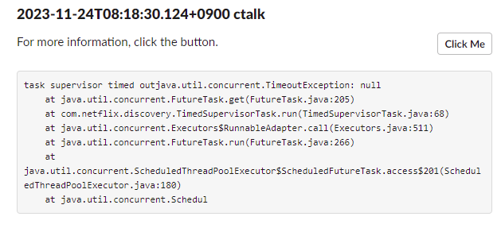

# Goals

- 테스트 기간에 발생하는 결함에 대해서 빠르게 대처하기 위해 만들었다.
- 기존에는 지라에 결함이 등록되면, 장애 내용을 바탕으로 elasticsearch 로그를 viewer를 통해 검색하거나 kibana를 통해 찾아야했다.
- 결함에 따라서는 시간이 지나서, 원인을 못찾는 경우도 발생했기 때문에 슬랙 메시지로 전송하면 보관이 가능한 장점이 있다.

# TO BE..

- readme에도 작성했지만, 아직은 실무 document 구조로만 동작하게 작성했다. 커스터마이징이 어렵지 않지만, 설정만으로도 가능하도록 리팩토링할 예정

# 작업 내용
- schedule을 통해서 2분마다 elastic search에 저장된 log를 elasticsearch-java API로 exception 로그를 검색한 후 
- 최대 건수에 한해서 슬랙 채널로 메시지 발송
- 버튼을 누르면 해당 document의 id를 통해 상세 로그를 확인할 수 있도록 링크 제공

# 구현

## 1. elasticsearch 검색 서비스 작성

- elasticsearch-java 의존성 추가

```java
implementation group: 'co.elastic.clients', name: 'elasticsearch-java', version: '7.17.15'
```

- document 검색
* 메시지에 exception이 포함된 데이터를 찾되, 400 클라이언트 에러는 must_not을 통해 제외

```java
Query fullNameQuery = MatchQuery.of(m ->  m.field("service").query(EsSearchProperties.getServices()))._toQuery();
Query wildcard = WildcardQuery.of(m -> m.field("message").wildcard(EsSearchProperties.getMessage()))._toQuery();
Query range = getTimestamp();
Query excludeQuery = MatchQuery.of(m ->  m.field("message").query(EsSearchProperties.getExcludeMessages()))._toQuery();
SearchResponse<Object> searchResponse = elasticsearchClient.search(s -> s
    .index(getIndexName())
    .query(q -> q.bool(b -> b.must(fullNameQuery, wildcard, range).mustNot(excludeQuery)))
    .sort(SortOptions.of(so -> so
        .field(f -> f
            .field("@timestamp")
            .order(SortOrder.Asc)
        )))
    .size(EsSearchProperties.getMaxCount()), Object.class);

log.debug("total count. {}", searchResponse.hits().total());

searchResponse.hits().hits().forEach(hit -> {
    LinkedHashMap<String, Object> hashMap = (LinkedHashMap) hit.source();
    list.add(new LogSearchResponseSdo(
        hit.index(),
        hit.id(),
        (String) hashMap.get("service"),
        (String) hashMap.get("message"),
        (String) hashMap.get("stacktrace"),
        (String) hashMap.get("@timestamp")));
});
```

## 2. slack channel에 메시지 발송

```java
static void publish(String channelId, String message) {
    var client = Slack.getInstance().methods();
    try {
        var result = client.chatPostMessage(r -> r
            .token(SlackProperties.getToken())
            .channel(channelId)
            .blocksAsString(message)
        );
        log.debug("message {}", message);
        log.info("result {}", result);
    } catch (IOException | SlackApiException e) {
        log.error("error: {}", e.getMessage(), e);
    }
}
```

# Repository

[hhttps://github.com/tnfhrnsss/elasticsearch_log_notifier](https://github.com/tnfhrnsss/elasticsearch_log_notifier){:target="_blank"}

# Output
