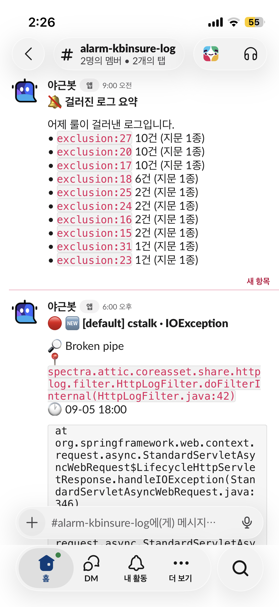
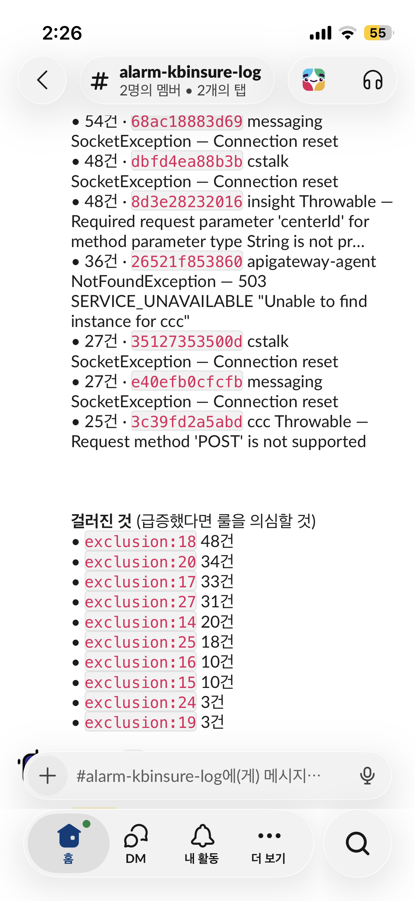
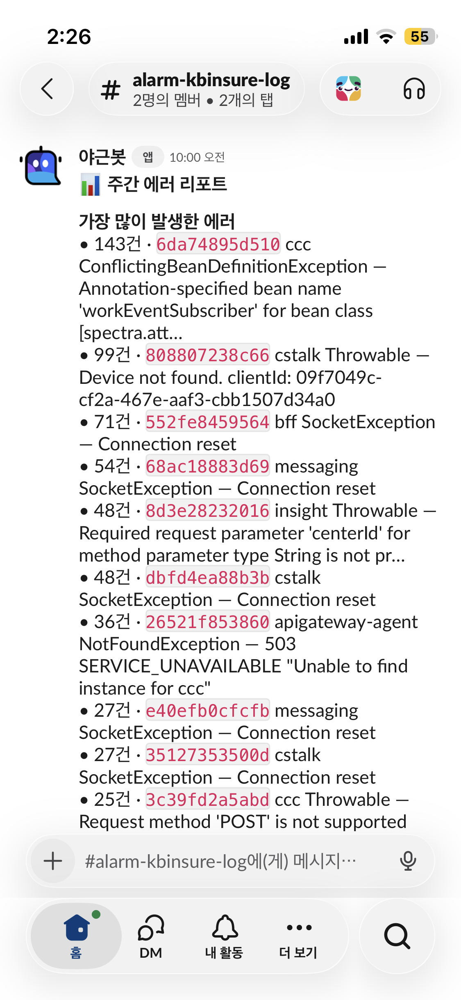

2023년에 만들었던 [ES Log Notifier](https://tnfhrnsss.github.io/docs/sub-projects/elasticsearch_log_notification/){:target="_blank"}를 3년 만에 다시 손봤습니다.

당시에는 **"exception 로그가 쌓이면 슬랙으로 보낸다"** 가 전부였습니다.

---

## v1의 한계

| # | 문제 | 결과 |
|---|------|------|
| 1 | 에러 판별이 `message` 와일드카드(`*exception*`) 하나 | 부정확하고 느림 |
| 2 | 같은 요청이 여러 곳에 로깅되면 중복 알림 | 같은 장애가 3~4번 도착 |
| 3 | `now-2m ~ now` 슬라이딩 윈도우 | 앱이 죽어 있던 구간의 로그 유실 |
| 4 | 상태가 없어서 같은 에러를 매 사이클 반복 알림 | 100건 터지면 100번 알림 |
| 5 | 슬랙에는 `message` 앞 500자만 | 정작 원인 파악은 결국 Kibana에서 |

그래서 알림 자체보다 *알림을 판단하는 부분*을 새로 만들기로 했습니다.

---

## Claude 설계부터..

바로 코드를 고치지 않고, Claude에게 **현재 코드의 문제 진단 + 개선 플랜**부터 쓰게 했습니다.

또 하나 명시한 전제는 **LLM/AI 미사용**입니다.
로그 분류를 LLM에 맡기면 쉬웠겠지만, 5분마다 도는 배치에 비용과 지연을 얹고 싶지 않았습니다.

---

## v2에서 달라진 것

| 기능                  | 설명 |
|---------------------|------|
| 의도된 에러 필터           | 401/403 같은 정상 동작은 룰로 제외 |
| 중복 제거               | 한 요청이 여러 곳에 로깅돼도 1건으로 |
| 지문(fingerprint) 그룹화 | 원인이 같은 100건 → 메시지 1건 + 건수 |
| 반복 억제               | 재발 시 10분 → 4시간으로 백오프 |
| 유실 없음               | 커서를 저장해 앱이 죽어 있던 구간까지 커버 |
| 읽히는 메시지             | 근본 원인 한 줄과 **내 코드 위치**가 맨 앞에 |
| 운영 노트               | 한 번 조사해 노트를 달면 재발 때마다 같이 표시 |
| 실시간 룰 적용         | Swagger에서 눌러 즉시 반영 |

목표로 삼은 슬랙 메시지 형태는 이렇습니다.

```
🔴 [prod] order-api · NullPointerException              ×37
──────────────────────────────────────────────────────────────
🔎 Cannot invoke "Member.getGrade()" because "member" is null
📍 com.example.order.OrderService.getOrderDetail(OrderService.java:142)
🕐 01-02 14:22 ~ 01-02 14:27

📌 운영 노트 (01-02 14:30 등록)
   탈퇴 회원의 과거 주문 조회 케이스. Optional 처리 필요. JIRA-1234

  at com.example.order.OrderService.getOrderDetail(OrderService.java:142)
  at com.example.order.OrderController.detail(OrderController.java:58)
  ... 43 more

[View full log]                          fp: a3f91c2b04d7
```

핵심은 **스택트레이스를 그대로 붙여넣지 않는 것**입니다.
근본 원인 한 줄, 내 코드 한 줄, 발생 구간. 이 세 줄이면 대부분 판단이 끝납니다.

{: width="50%" height="50%"}

---

## 구현에서 재미있었던 부분

### 1. 문서 구조를 설정으로 뺐다

v1에서 `EsSearchService`에 `"service"`, `"message"`, `"@timestamp"` 같은
필드명이 박혀 있었던 부분을 전부 매핑으로 뺐습니다.

```yaml
monitoring:
  es:
    search:
      index-pattern: "logs_*"
      fields:
        timestamp: "@timestamp"
        severity: "severity"                  # ECS면 log.level
        severity-error-values: ["ERROR", "FATAL"]
        service: "service"
        message: "message"
        stacktrace: "stacktrace"
        trace-id: "traceId"
        keyword-suffix: ".keyword"            # 서브필드가 없으면 ""
```


### 2. ES 쿼리는 최소한으로, 판단은 전부 애플리케이션에서

처음엔 필터를 전부 ES 쿼리로 밀어 넣으려 했는데, 플랜 단계에서 뒤집었습니다.

```json
{ "bool": { "must": [
  { "terms": { "<severity>.keyword": ["ERROR","FATAL"] } },
  { "range": { "<timestamp>": { "gte": "<cursor>" } } }
]}}
```

레벨과 시간 범위만 좁히고, 나머지는 전부 자바에서 판단합니다. 이유는 셋이었습니다.

1. `.keyword`에 `ignore_above`가 걸린 매핑에서는 "이 필드가 비었나?"를 쿼리로 답할 수 없다
2. ERROR 레벨은 전체 로그의 0.001~1% 수준이라 전량을 가져와도 비용이 거의 없다
3. 룰이 자바에 모이면 **픽스처로 테스트할 수 있다**

3번이 결정적이었습니다. ES 쿼리에 로직이 들어가면 검증할 방법이 실제 인덱스밖에 없습니다.

### 3. 무엇으로 묶을 것인가

같은 원인의 에러를 하나로 묶는 12자 해시입니다.
여기서 갈린 결정이 **"메시지를 지문에 넣을 것인가"** 였습니다.

- **스택트레이스가 있으면** 예외 클래스 + *내 코드 프레임*으로 만듭니다.
  메시지를 넣으면 파라미터 값 차이 때문에 같은 버그가 수십 종으로 쪼개집니다.
- **스택트레이스가 없으면** 메시지가 유일한 식별 근거이므로 UUID·16진수·숫자를 치환한 정규화 메시지를 씁니다.

### 4. 유실 없이, 중복 없이

v1의 `now-2m ~ now` 슬라이딩 윈도우를 커서로 바꿨습니다.

- 조회 하한은 `last_timestamp - lag-buffer(30초)` — 인덱싱이 늦은 문서를 되감아 잡습니다
- **슬랙 전송이 성공한 뒤에만 커서를 전진**시킵니다 (v1은 전송 예외를 삼키고 지나가 유실됐습니다)

그런데 되감으면 이미 처리한 문서를 다시 만납니다.
인덱싱 지연 때문에 *커서보다 과거 시각*으로 뒤늦게 들어오는 문서가 실재해서,
"커서보다 과거면 이미 처리했다"는 판정을 쓸 수 없었습니다.
그래서 처리한 문서 id를 남기는 테이블을 따로 뒀습니다.

조회 하한보다 오래된 행은 다시 조회될 수 없으므로 매 실행 때 지웁니다. 무한히 커지지 않습니다.

### 5. 반복을 어떻게 참을 것인가

같은 지문이 계속 발생할 때 채널에 다시 올릴지 결정하는 부분입니다.

- 새 지문이면 채널에 새 메시지
- 백오프(10 → 30 → 60 → 240분)를 넘겼으면 채널에 다시 올림
- 그 사이면 **원본 메시지의 스레드에 리플 + 부모 메시지 건수를 `chat.update`로 갱신**
- 그것도 아니면 조용히 카운트만 누적

덕분에 100건이 터져도 채널에는 메시지 하나가 남고, 숫자만 `×37` 처럼 올라갑니다.

{: width="50%" height="50%"}

### 6. 재기동 없이 제외 룰 적용

슬랙 알림이 왔는데 "이건 의도된 에러네" 싶을 때가 있습니다.
룰 파일을 고치지 않고, 즉시 적용가능한 런타임 제외 API를 뒀습니다.

```bash
# 슬랙 알림 하단의 fp 값을 그대로 붙여넣는다
curl -X POST localhost:8080/eslog/exclusions \
  -H 'Content-Type: application/json' \
  -d '{"matchType":"FINGERPRINT","matchValue":"a3f91c2b04d7","reason":"expected 401"}'
```

### 7. 서비스가 조용히 죽는 문제

30분 동안 ES 조회가 한 번도 성공하지 못하면 슬랙에 한 번 경고하고, 복구되면 다시 알려줍니다.

### 8. 상태 저장소는 SQLite 파일 하나

지문·커서·제외 규칙·집계를 모두 SQLite 파일 하나에 넣었습니다.
서버 프로세스도, 포트도, 계정도 없고 백업은 파일 복사입니다.
날아가도 커서 재부트스트랩과 알림 한 번 몰리는 정도로 끝나는 데이터라 이 정도가 적당했습니다.

### 9. ES 클라이언트 버전 변경 대응

기존에는 7.x만 대상이였던 것을 이번에는 대상 서비스가 es버전이 달라져서 같이 변경이 필요했는데요.
이걸 버전 명시 대신 아래처럼 스프링부트 버전자체에 의존하는 것으로 바꿨습니다.

```gradle
// v2 — Spring Boot 3.3.5
// 버전은 Spring Boot 가 관리한다. 직접 고정하면 ES 자동설정과 어긋나 기동이 깨진다.
implementation 'co.elastic.clients:elasticsearch-java'
```

---

## 해보고 남은 생각

**1. LLM을 안 쓰기로 한 것도 설계였다**

로그 분류는 LLM이 잘하는 일이지만, 5분마다 도는 배치에 외부 호출을 넣는 순간
비용·지연·장애 포인트가 하나 늘어납니다.
**AI로 만들었다고 해서 AI가 런타임에 있어야 하는 건 아니라는 것**이 이번 작업의 결론입니다.

**2. 남은 것**

- 룰이 늘어나는 걸 어떻게 막을지

---

## Repository

[https://github.com/tnfhrnsss/elasticsearch_log_notifier](https://github.com/tnfhrnsss/elasticsearch_log_notifier){:target="_blank"}

이전 글: [Exception logs accumulated in Elasticsearch, send a notification to a Slack channel](https://tnfhrnsss.github.io/docs/sub-projects/elasticsearch_log_notification/){:target="_blank"}

---

## Output

{: width="50%" height="50%"}
