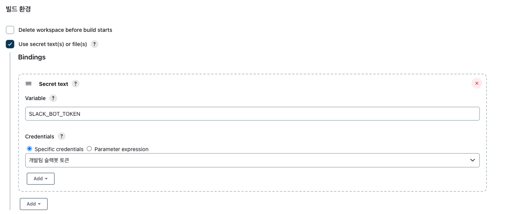

# Goals

- build fail이 발생하면, front 서버도 문제가 발생해서 생산성이 떨어지고 있다.
- 슬랙 알림이 와도, 담당자를 지정하지 않으면 조치가 되지 않아서, 간단한 문제도 처리가 지연되는 상황이 자주 발생
- 맵핑할 사용자가 해당 채널에 존재하지 않는 경우, 어드민에게 dm발송하도록 함

# TO BE..

- 실패난 코드 정보를 jenkins 로그에서 추출해야만 정확한 담당자를 지목할 수 있지만, 그게 안되어서 빌드 실패난 모듈의 git history를 조회하는 방식으로 작업했다.
- 장기적으로는 jira에 feature branch를 연결해서, task branch 단위로 빌드하고 결과를 담당자에게 알려주는 것으로 프로세스 검토가 필요하다.

# 작업 내용
- API들은 feign client를 통해서 개발했다.
- jenkins pipeline script를 통해 실패시 API를 호출하도록 했다.

### 23.10.15
- 슬랙 메시지에 job name 추가

# 구현

## 1. 실패시 호출될 API 스펙 작성

- path variable
    - projectId : 실패한 프로젝트 아이디
    - branch : 실패한 프로젝트 브랜치명

```bash
curl -X POST 'http://localhost:7777/jenkins/projects/{projectId}/{branch}/alarm'
```

## 2. Get Git History

- jgit 의존성 추가

```java
implementation group: 'org.eclipse.jgit', name: 'org.eclipse.jgit', version: '6.7.0.202309050840-r'
```

- repository 하위의 history 조회

```java
File localPath = new File(repositoryUrl);

try (Repository repository = new RepositoryBuilder().setGitDir(localPath).build()) {
  Repository existingRepo = new FileRepositoryBuilder()
      .setGitDir(localPath)
      .build();

  Ref master = existingRepo.findRef(branch);
  if (master != null) {
      ObjectId objectId = master.getObjectId();
      try (RevWalk revWalk = new RevWalk(repository)) {
          RevCommit commit = null;
          try {
              commit = revWalk.parseCommit(objectId);
          } catch (IOException e) {
              throw new RuntimeException(e);
          }
          log.debug("Last Pushed Commit Hash: " + commit.getName());
          log.debug("Author: " + commit.getAuthorIdent().getName());
          log.debug("Date: " + commit.getAuthorIdent().getWhen());
          log.debug("Message: " + commit.getFullMessage());
          log.debug("Email:" + commit.getAuthorIdent().getEmailAddress());
      }
  } else {
      log.error("Remote branch not found.");
  }
} catch (IOException e) {
  throw new RuntimeException(e);
}
```

## 3. Mapping Slack User

- git의 author email주소와 slack에 가입한 회사 이메일 주소로 매칭한다.

```java
static Map<String, String> findAll(List<String> members) {
    var client = Slack.getInstance().methods();

    members.forEach(user -> {
        try {
            var result =  client.usersInfo(r ->
                r.token(SlackProperties.getToken()).user(user.trim())
            );

            String email = result.getUser().getProfile().getEmail();
            if (StringUtils.isNotEmpty(email)) {
                profiles.put(email, user);
            }

        } catch (Exception e) {
            throw new RuntimeException(e);
        }
    });

    return profiles;
}
```

## 4. Jenkins 설정

- pipeline
    
    ```groovy
    post {
      failure {
          script {
            // Define the API URL
            def apiUrl = "http://localhost:7777/jenkins/projects/${failRepo}_${failBranch}/${failBranch}/alarm"
            def response = sh(script: "curl -X POST -H 'Content-Type: application/json' -d '' '${apiUrl}'", returnStatus: true)
            if (response != 0) {
                slackSend (channel: '#rnd-engineering', color: '#FF0000', message: "<${BUILD_URL}|${JOB_NAME}>\n일일 빌드 실패: group/project/branch - ${currentRepo}")
            }
          }
      }
    }
    ```
    
    - api발송에 실패할 경우, jenkins에 연동한 slackSend기능을 통해서 발송하도록 설정


# 참고

- jenkins에 slack token을 저장해두고 job에서 변수로 쓰고 싶을 때
  * jenkins 콘솔 > credential 관리에서 토큰을 생성하고 
  * use scret text or file을 선택하면 credential 설정을 sh에서 변수로 사용할 수 있다.
  * https://stackoverflow.com/a/43764192/14257397

  

# Repository

[https://github.com/tnfhrnsss/jenkins_slack_notifier.git](https://github.com/tnfhrnsss/jenkins_slack_notifier.git){:target="_blank"}

# Output