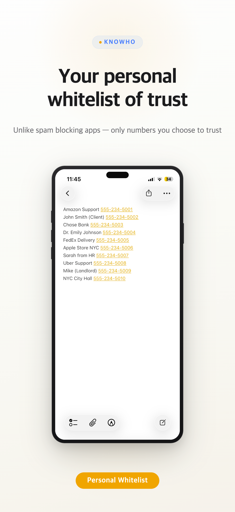
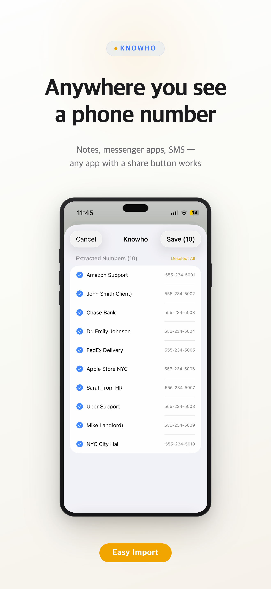
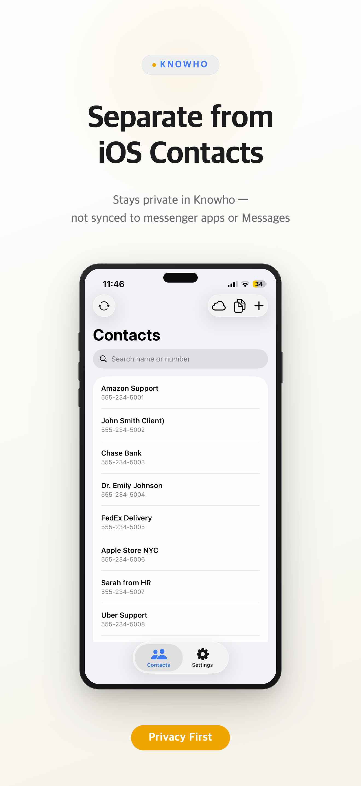
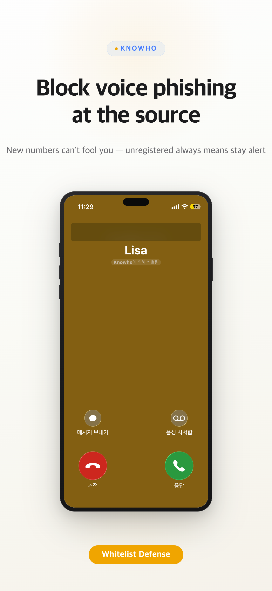

# Knowho

**Your personal whitelist of trust.**
Unlike spam blockers — only the numbers *you* choose to trust get a name.

[Download on the App Store](https://apps.apple.com/app/id6760998976){: .btn .btn-purple target="_blank"}

---

## The Problem

Spam-blocking apps work from a blacklist: they only catch *known* bad numbers.
Voice phishing scammers simply rotate through fresh numbers — and slip right through.

Knowho flips the model. Instead of blocking the bad, you **whitelist the good**.
Any number not on your list? Stay alert. It doesn't matter how new or "clean" the number is.

---

## What Knowho Does

Paste text from any app — a messenger chat, an SMS, a note — and Knowho automatically extracts the phone numbers and names, then registers them with iOS's call system.
The next time one of those numbers calls you, **your iPhone shows who it is**.

No servers. No cloud sync. Everything stays on your device.

---

## Key Features

| Feature | Detail |
|---------|--------|
| **Whitelist-based caller ID** | Only numbers you register get identified |
| **Smart text extraction** | Paste any text; numbers and names are pulled out automatically |
| **Completely offline** | No server, no account, no internet required |
| **Separate from iOS Contacts** | Numbers stay in Knowho — never synced to iCloud Contacts, iMessage, or KakaoTalk |
| **Multi-language support** | English, Japanese, Korean — international number formats detected automatically |
| **Share Extension** | Import directly from any app with a share button |

---

## How It Works

**Step 1 — Paste or share text**
Copy a message from any chat or note, paste it into Knowho — or use the share sheet directly from any app.

**Step 2 — Review extracted contacts**
Knowho highlights the phone numbers and suggested names it found. Edit anything before saving.

**Step 3 — Call comes in, you know who**
iOS shows the registered name on your lock screen — powered by Apple's CallKit, with zero data leaving your phone.

---

## Screenshots

  
  
  
  

---

## Pricing

| | Free | Pro |
|-|------|-----|
| Contacts | 20 | 5,000 |
| CSV import | — | ✓ |
| iCloud backup & restore | — | ✓ |
| Offline & private | ✓ | ✓ |
| Share Extension | ✓ | ✓ |

Pro is a one-time in-app purchase.

---

## Why Not Just Use the Contacts App?

iOS Contacts syncs everywhere — iCloud, iMessage, and third-party apps like Messenger App all pick up your contacts automatically.
Sometimes that's exactly what you *don't* want: delivery drivers, temp work numbers, client contacts that shouldn't show up as chat friends.

Knowho is a private, siloed list. It identifies callers without polluting your real address book.

---

[Get Knowho on the App Store](https://apps.apple.com/app/id6760998976){: .btn .btn-purple target="_blank"}
