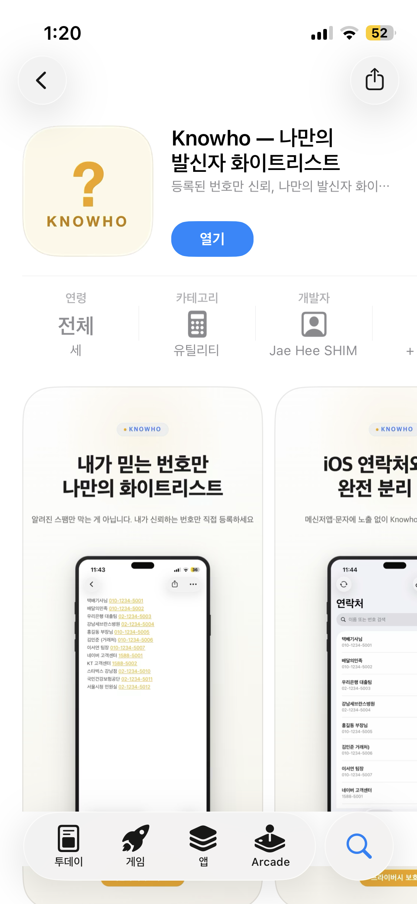

저는 Swift가 없던 시절에 회사 앱을 만들어서 출시해본 경험이 1번 있었습니다.  
그 이후에 Swift는 제대로 써본 적 없는 상태에서,  
이번에 Claude Code와 함께 iOS 앱을 만들어 App Store에 출시하기까지의 경험을 정리했습니다.  

**작업 기간:** 2026년 3월 15일 ~ 3월 27일 (약 2주)
- 기획
- 개발
- 테스트
- 배포
- 출시

---

## 왜 만들었나

최근에 개인 핸드폰번호로 걸려온 보이스피싱 전화를 받은 적이 여러 번 있었고,  
두번 속을 뻔했지만😤, 간신히 전화를 끊고 나니 찝찝함이 계속되던 중..   
스팸방지 앱에서도 못잡는 이 번호들을 피할 수 있는 방법이 없나 하고 고민하게 되었습니다.  

**스팸방지앱 접근법:** 알려진 스팸 번호 블랙리스트 DB기준으로  
→ 새로운 번호로 바꿔가며 오는 보이스피싱은 한계가 있는 것 같습니다.  

제가 원한 건 이거였습니다.  

> **"내가 아는 사람만 화이트리스트로 등록하고, 나머지는 경계 대상"**

번호를 아무리 바꿔도, 제가 아는 화이트리스트에 없으면 경계 대상이 되는 구조로   
DB 기반보다 오히려 더 강력한 보이스피싱 방어가 될 수 있겠다는 생각이 들었습니다.  

그리고 한 가지 더.  
회사 동료 번호나 고객사 담당자 연락처나 택배 기사님 전화번호 등등을 기본 연락처앱에 넣으면   
카카오톡에 동기화 되어 친구로 등록되고 노출되는 것이 불편했었는데요.  
그래서 항상 #을 붙이고 동기화는 꺼버리는 등의 설정을 해야만 했었습니다.  
그래서 특정 관리 영역 안에서만 등록해서 관리하되, 전화가 오면 누구지 알수 있는 정도면 된다고 생각했었습니다.  

그렇게 **Knowho**가 시작되었습니다.  

---

## Knowho가 뭔데

카카오톡, 문자, 메모 등에서 텍스트를 붙여넣으면 전화번호를 자동 추출해서 iOS 전화 시스템에 등록해주는 앱입니다.  
이후 해당 번호에서 전화가 오면 이름이 표시됩니다.  

- 완전 오프라인, 서버 없음
- iOS 연락처와 완전히 분리된 독립 저장소
- 한국어·일본어·영어 지원 (다국가 번호 형식도 자동 감지)
- 무료: 20개 / Pro: 5,000개 + CSV 가져오기 + iCloud 백업/복구

[App Store에서 보기](https://apps.apple.com/app/id6760998976){:target="_blank"}

{: width="50%" height="50%"}

---

## 기술 스택

| 항목 | 내용 |
|------|------|
| 언어 | Swift 5.9+ |
| UI | SwiftUI |
| 아키텍처 | MVVM + `@Observable` |
| 최소 타겟 | iOS 17.0 |
| 핵심 프레임워크 | CallKit (Call Directory Extension) |
| 인앱결제 | StoreKit 2.0 |
| 데이터 저장 | App Groups 공유 컨테이너 (기기 로컬) |

---

## 바이브코딩 경험

### 도구

**Claude Code** (CLI)를 메인으로 사용했습니다.   
터미널에서 `claude` 명령어로 대화하면서 코드를 짜는 방식으로,  
인텔리제이와 다르게 LSP는 별도로 설치해줘야 swift를 구현할 수 있어서  
직접 설치한 도구는 LSP 하나였습니다.   

### 어떻게 진행했나

"Swift를 잘 몰라도 된다. 아키텍처를 설명하고 원하는 기능을 말하면 Claude가 코드를 짜준다."  

예를 들면 이런 식으로 시작했습니다.  

```
"iOS Call Directory Extension을 써서 발신자 이름을 표시하는 앱을 만들고 싶어.
App Groups로 메인 앱과 Extension이 데이터를 공유해야 하고,
전화번호는 E.164 형식 Int64로 저장해야 해."
```

이렇게 말하면 MVVM 구조, App Group 설정, CallKit Extension 코드까지 한번에 작성됩니다.  

### 좋았던 점

**CLAUDE.md 파일이 핵심이다.**  
프로젝트 루트에 CLAUDE.md를 만들어두면, 새 세션을 시작해도 컨텍스트가 유지됩니다.  
Bundle ID, App Group 식별자, 아키텍처 규칙, 다국어 처리 규칙 등을 한번 정리해두면 매번 설명 안 해도 됩니다.  

**리팩토링도 잘 한다.**  
"이 서비스를 @Observable로 바꿔줘", "StoreKit 2.0으로 마이그레이션해줘" 같은 요청도 무리 없이 처리됩니다.  

**다국어 처리가 깔끔하게 됐다.**  
처음에 한국어를 코드에 하드코딩했다가, 나중에 일본어 지원을 추가하면서 Localizable.xcstrings로 전면 이관했는데,  
Claude가 키 정리부터 번역값까지 한번에 작성해줘서, 이건 정말 편했습니다.  

**iOS 정책 체크도 해줬다.**  
"앱 출시 전에 빠뜨린 게 없는지 검토해줘"라고 했더니, 개인정보 처리방침 페이지 필수 등록, Call Directory Extension 관련 권한 설명, 앱 설명 문구 가이드라인 등을 짚어줬습니다.  
App Store 심사 정책을 혼자 다 파악하려면 꽤 오래 걸렸을 텐데, 이런 부분을 자동으로 체크해주는 건 정말 유용했습니다.  

**수익 구조도 같이 고민했다.**  
무료/유료 기능을 어떻게 나눌지, 제한 수를 얼마로 잡는 게 적당한지를 Claude에게 물어봤습니다.  
"연락처 20개 무료, 5000개 Pro"라는 기준도 Claude의 의견을 참고해서 정했고,  
"CSV 가져오기는 유료가 맞는가", "iCloud 백업은 Pro 전용이 합리적인가" 같은 질문에도 나름의 근거를 가지고 답해줬습니다.  
코딩 도구를 넘어서 기획 파트너로도 쓸 수 있다는 걸 이번에 느꼈습니다. 👍  

### 아쉬웠던 점

**Xcode 프로젝트 파일(.pbxproj)은 여전히 수동이다.**  
새 파일을 추가할 때 Claude가 Swift 코드는 만들어줘도, Xcode 프로젝트에 등록하는 건 직접 해야 합니다.  

**identity 설명**  
CLAUDE.md나 README.md를 작성해놔도, 가끔씩 이 앱이 하고자하는 방향을 다시 말해야했는데요.  
이것이 컨텍스트 롯인가..싶기도 했습니다 ^^;  

**테스트**  
누군가는 cmux와 같은 것을 만들고 있겠죠? 아니면 이미 있을까요?  
테스트를 시뮬레이터나 실기기에 아직은 의존해야한다는점이 있습니다.  

---

## 프로젝트 구조

```
Knowho/          ← 메인 앱
CallDirectory/   ← Call Directory Extension (발신자 표시)
ShareExtension/  ← 공유 Extension (다른앱의 공유기능에서 바로 가져오기)
```

ShareExtension은 중간에 추가했는데, "카카오톡에서 텍스트 공유 → Knowho로 바로 저장" 흐름을 만들고 싶었기 때문입니다.   
이것도 Claude Code에 요청해서 만들었습니다.  

---

## 느낀 점

Swift를 처음 써봤는데 App Store 출시까지 하게 되었네요!!  
Claude Code가 없었으면 CallKit Extension 구조나 StoreKit 2.0 구현을 혼자 파악하는 데만 몇 주가 걸렸을 것 같습니다.  

물론 어느 정도는 코드를 "이해"하면서 해야하는 건 마찬가지인 것 같습니다.  
Claude가 짜준 코드를 읽고, 왜 이렇게 했는지 물어보면서 가는 게 유지보수 측면에서도 맞는 것 같습니다.  

바이브코딩의 핵심은 결국 **내가 원하는 것을 얼마나 잘 설명하느냐**인 것 같습니다.  
도메인 지식(CallKit이 어떻게 동작하는지, App Group이 왜 필요한지 등)을 알고 있으면 프롬프트 품질이 올라가고,  
결과물도 좋아지는 것 같습니다.  

한 가지 더 추가하자면, **처음 도전하는 프로젝트라면 Knowho처럼 범위가 작은 것부터 시작하는 게 좋을 것 같습니다.**
엔터프라이즈급 기능(복잡한 인증 흐름, 대용량 데이터 처리 등)을 첫 바이브코딩 대상으로 잡으면,  
Claude가 코드를 짜줘도 내가 리뷰하고 방향을 잡기가 버겁습니다.  
"서버도 없고, DB도 없고, 딱 이 기능 하나" 수준의 앱을 먼저 완성해보는 게 감을 잡는 데 훨씬 효과적이었습니다.  

---

## 링크

- [App Store – Knowho](https://apps.apple.com/app/id6760998976){:target="_blank"}
