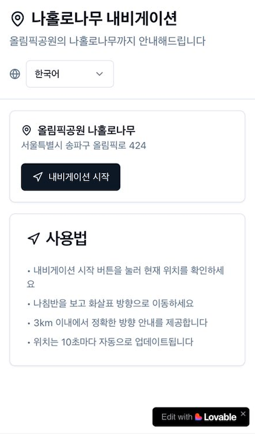

# Lovable 러버블이란?

- AI 기반의 노코드(no-code) 플랫폼으로
- 메시지 입력만으로 웹사이트나 웹 애플리케이션을 쉽고 빠르게 만들 수 있게 돕는 도구입니다.
- 코딩에 대해 모르는 사람도 사용할 수 있으며
- AI가 프론트엔드와 백엔드를 포함한 풀스택으로 서비스를 자동으로 생성해 주며
- 아직 해보진 않았지만, 이미지만 첨부해도 해당 서비스를 만드는게 가능하다고 합니다.
- 웹 뿐만 아니라 앱도 가능하다고해서, 다음 프로젝트는 앱으로 도전~

# 사용 방법

1. [https://lovable.dev/](https://lovable.dev/){:target="_blank"} 가입하기
2. DB가 필요하다면, supabase에 가입하고 연동을 해야한다. 
    1. 연결방법 ([https://docs.lovable.dev/integrations/supabase](https://docs.lovable.dev/integrations/supabase)){:target="_blank"}
3. github에 연결하면, 프로젝트 코드를 모두 이관받을 수 있다.
4. 무료 크레딧은 하루 5개이므로 잘 활용해보자 😁

# 특⭐️ 장점

- mvp로 간단하게 검증할때 mock 데이터로써 활용 가능
- 비개발자와 논의할때 mock화면을 빠르게 작성해서 효율성 👍
- saas까지 제공하기 때문에 더더욱 👍👍
- github 연동하면, 브랜치로 바로 푸시가 가능하기 때문에, 사람이 코딩하는것 하고 같이 바이브가 가능

---

# Lonely Tree Guide 프로젝트

## 1. 제작 과정

## 1-1. 기획

- 배경
    - 동네에 나홀로 나무라고 있는데요. (외국인들이 질문하기 전까지 몰랐음. 🤣)
    - 산책하다가 저 나무를 찾는 관광객들이 의외로 많다는 것을 알게되었습니다.  (왜 ???)
    - 하지만 찾기 쉽지 않은 위치에 있어서 찾아갈 수 있는 서비스를 만들어보기로 했습니다.
- 유저 스토리
    - 현재 나의 위치가 나무로부터 반경 3키로미터 이내에 있는 경우에만 사용할 수 있다.
    - 현재 위치를 알려면, 위치 동의를 얻어야한다.
    - 갱신버튼을 통해 현재 위치를 얻어서, 나침반으로 방향을 알려준다.
    - 다양한 언어로 사용할 수 있어야한다.
- 비기능
    - 맵 API 없이도 사용가능해야한다.
    - WAS없이도 가능해야한다.

## 1-2. 구현 단계

- 러버블에서 프로젝트 생성
- 기본 UI 구조 및 사용언어(reactjs) 특정
- 지도 API(예: 카카오맵, 네이버지도, 구글맵 등) 연동 활용 가능성 분석 및 적용 → 사용안하는 것으로 결정(oauth 인증 복잡함으로 사용성이 떨어지는 것 우려)
- 지도 API 없이, 검색/길찾기 기능 구현 요청
- 반응형 웹 디자인 적용
- 다국어 적용

## 1-3. GitHub 연동

- GitHub에 자동 커밋되는 구조
- 직접 코드 수정 후 러버블에도 반영
- [github repo 주소](https://github.com/tnfhrnsss/lonely-tree-guide){:target="_blank"}

## 2. 개발 중 문제와 해결

- 프리뷰가 안 뜨는 **"Preview has not been built yet"** 오류 겪은 경험
- 빌드 에러를 확인하고 내가 github코드를 수정해서 러버블에 다시 반영하게 되는 과정 진행
- 기타 디버깅 로그 추가하는 자정적?능력치 보여줌

## 3. 스크린샷

{: width="50%" height="50%"}

{: width="50%" height="50%"}

---

# 느낀 점

- 앞서 말한 장점에 플러스하면, 재미있습니다.
- 무료 크레딧이 5개뿐이기 때문에, 이 친구가 버그가 있으면 안타까운 상황이 일어날수 있으니 프롬프트를 잘 작성해야합니다.
- 저는 이 서비스를 만드는데에 대략 30개 정도 사용한 것 같습니다.
- AI답게 스스로 디버깅 코드를 추가하고, 크롬 개발자 도구에서 확인해서 말해달라고 하는데요.…🫢. 놀라운 인터랙션 경험이였습니다.