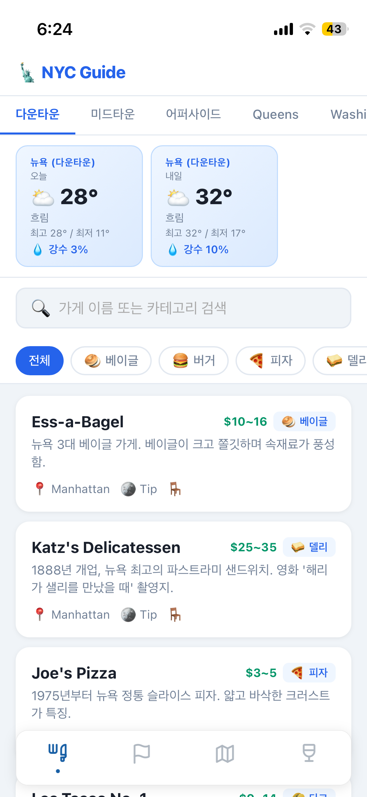
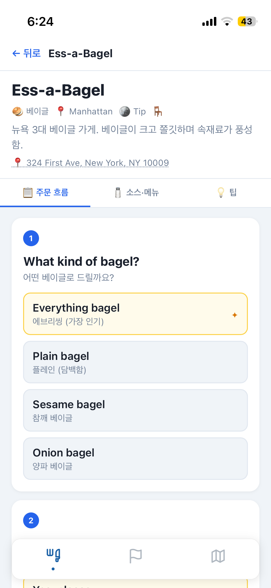
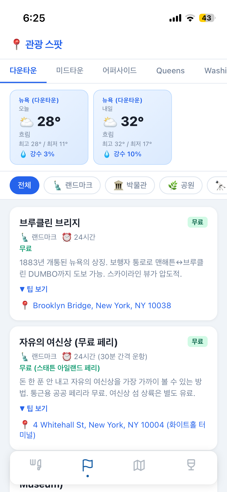

뉴욕 여행을 앞두고 걱정이 하나 있었습니다.

주문할 때 어떻게 하는지!

> "Everything bagel or plain?" 
> "Toasted?" 
> "On the side or on the bagel?"

베이글 하나 시키는데도 이렇게 물어봅니다. 

그래서 여행 전에 Claude로 **현지 주문 가이드 웹앱**을 만들었습니다.

---

## 어떤 앱인가

**NYC Order Guide** — 뉴욕·퀸즈·워싱턴 D.C.를 여행하는 한국인을 위한 오프라인 우선 웹앱입니다.

라이브 주소: [https://tnfhrnsss.github.io/nyc/us-order-guide/](https://tnfhrnsss.github.io/nyc/us-order-guide/)

핵심 기능은 이렇습니다:

| 기능 | 설명 |
|------|------|
| 맛집 주문 가이드 | 가게별 예상 질문 순서와 추천 답변을 한영 병기로 제공 |
| 소스·메뉴 설명 | 처음 보는 소스 이름을 한국어로 확인 |
| 관광 스팟 | 무료/유료, 예약 여부, Google Maps 연결 |
| 날씨 | 지역별 오늘·내일 날씨 (Open-Meteo API) |
| 화장실 찾기 | 현재 위치 기반 주변 화장실 지도 |
| 오프라인 지원 | Service Worker로 앱 전체 캐시 → 지하철에서도 동작 |

{: width="50%" height="50%"}

---

## 왜 만들었나

여행 중에 가장 많이 쓰는 건 구글 번역이지만, 
현장에서 번역기를 켜고 입력하고 기다리는 건 사실 꽤 번거롭습니다. 
특히 바쁜 점심시간 카운터 앞에서는 더욱 그렇습니다.

제가 원했던 건 이거였습니다.

> **"줄 서 있는 동안 가게를 검색해서, 어떤 질문이 올지 미리 파악하고, 추천 답변을 결정해두는 것"**

구글 번역처럼 즉흥적으로 대응하는 게 아니라, 예행연습을 미리 해두는 방식이죠.

그리고 뉴욕 지하철은 와이파이가 없습니다. 오프라인에서도 완전히 동작해야 했습니다.

---

## Claude Code로 만든 과정

기술 스택은 일부러 단순하게 잡았습니다.

```
HTML5 + Vanilla JS  (빌드 도구 없음)
CSS                 모바일 우선, 단일 파일
Leaflet.js          지도 + OpenStreetMap
Open-Meteo API      날씨 (무료, API 키 불필요)
Service Worker      오프라인 PWA
GitHub Pages        배포
```

빌드 도구가 없으면 Claude Code가 파일을 수정하자마자 브라우저에서 바로 확인할 수 있어서 이터레이션이 빠릅니다.

### 데이터 설계부터 시작

가장 중요한 건 `stores.json` 데이터 구조였습니다. 가게별로 주문 흐름(ordering_flow)을 단계별로 기록하고, 각 단계마다 예상 질문과 옵션, 추천 여부를 담을 수 있게 스키마를 먼저 설계했습니다.

```json
{
  "id": "ess-a-bagel",
  "name": "Ess-a-Bagel",
  "ordering_flow": [
    {
      "step": 1,
      "question_en": "What kind of bagel?",
      "question_ko": "어떤 베이글로 드릴까요?",
      "options": [
        { "en": "Everything bagel", "ko": "에브리씽 (가장 인기)", "recommended": true },
        { "en": "Plain bagel", "ko": "플레인 (담백함)" }
      ]
    }
  ]
}
```

이 스키마 하나로 코드를 전혀 수정하지 않고 가게를 추가할 수 있습니다. 45곳의 맛집 데이터를 넣었는데, 대부분 Claude Code가 채워줬습니다.

{: width="50%" height="50%"}

### Service Worker 오프라인 지원

뉴욕 지하철에서도 동작해야 했기 때문에 Service Worker로 앱 전체를 캐시했습니다. 처음 접속할 때 한 번만 다운로드하면 이후엔 네트워크 없이도 완전히 동작합니다.

```javascript
// sw.js
const CACHE_NAME = 'nyc-guide-v3';
const urlsToCache = [
  '/nyc/us-order-guide/',
  '/nyc/us-order-guide/index.html',
  '/nyc/us-order-guide/store.html',
  // ...
];
```

날씨 데이터는 마지막으로 받아온 캐시를 보여주고, 온라인이 되면 자동으로 갱신합니다.

### PWA로 홈 화면에 설치

`manifest.json`을 작성해서 PWA로 만들었습니다. 사파리에서 "홈 화면에 추가"하면 앱처럼 설치됩니다. 여행 중에는 브라우저를 열 필요 없이 바로 실행할 수 있어서 편했습니다.

---

## 실제로 여행에서 써보니

커버리지는 이렇게 구성했습니다:

{: width="50%" height="50%"}

- **Manhattan 다운타운** (14곳): Ess-a-Bagel, Katz's Delicatessen, Joe's Pizza, Los Tacos No. 1 등
- **Manhattan 미드타운** (11곳): The Halal Guys, Shake Shack, Burger Joint 등
- **Manhattan 어퍼사이드** (6곳): Levain Bakery, Gray's Papaya 등
- **Queens** (5곳): Xi'an Famous Foods, Nan Xiang Xiao Long Bao 등
- **Washington D.C.** (9곳): Ben's Chili Bowl, Old Ebbitt Grill 등

에싸 베이글에서 실제로 써봤는데, 주문 흐름을 미리 읽어두니 카운터 앞에서 당황하지 않았습니다. ㅎㅎ
날씨 기능도 생각보다 유용했습니다. 매일 아침 숙소에서 출발할 때 항상 확인하고 하루를 시작했었습니다.
---

## 소스 코드 & 라이브

- **GitHub**: [https://github.com/tnfhrnsss/nyc](https://github.com/tnfhrnsss/nyc)
- **라이브**: [https://tnfhrnsss.github.io/nyc/us-order-guide/](https://tnfhrnsss.github.io/nyc/us-order-guide/)

빌드 없이 로컬에서 실행하려면:

```bash
cd us-order-guide
python3 -m http.server 8787
# http://localhost:8787
```

---

뉴욕 가시는 분들은 한번 써보세요. 🗽
