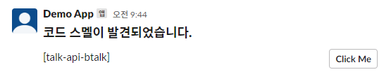
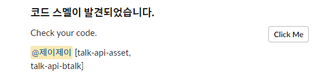

# Goals

- 항상 릴리스 때 몰아서 처리해야했던 코드스멜을 일배치 점검을 통해서 빠른 릴리스될 수 있도록
- 검증 컴포넌트가 많다보니, 매번 소나큐브 콘솔 통해서 확인해야하는 불편함 해소
- 본인이 작업한 코드는 본인이 처리하도록 하는 독려와 강요 사이..

# 작업 내용
- API들은 feign client를 통해서 개발했다.
- 일단 jar로 만들고 API로 호출하도록 했다.

### 23.08.02 
- hotspot도 검출된 결과를 알림하도록 추가

### 23.09.15 #12
- delivery type 추가 
    * dm or mention
- mention의 경우, 공개채널에 알림하는 것으로 메시지는 통합해서 한번만 발송된다.

# SonarQube API
- 릴리스 대상 컴포넌트들은 yml에 설정하고 검증 대상으로 했다.

## Get codesmell
- 사용한 이슈 검색 search api
    - /api/issues/search
    - code-smell search 파라미터
    
    ```bash
    curl --location 'http://localhost:9100/api/issues/search?componentKeys=&s=FILE_LINE&resolved=false&types=CODE_SMELL&ps=100&facets=severities%2Ctypes&additionalFields=_all&timeZone=Asia%2FSeoul'
    ```
    
    - response
        
        ```bash
        {
            "total": 8,
            "p": 1,
            "ps": 100,
            "paging": {
                "pageIndex": 1,
                "pageSize": 100,
                "total": 8
            },
            "effortTotal": 40,
            "issues": [
                {
                    "key": "AYhwJmBB5K8chirpKye_",
                    "rule": "java:S4968",
                    "severity": "MINOR",
                    "component": "",
                    "project": "",
                    "line": 20,
                    "hash": "baa052d59356658032eda75e980c8241",
                    "textRange": {
                        "startLine": 20,
                        "endLine": 20,
                        "startOffset": 50,
                        "endOffset": 64
                    },
                    "flows": [],
                    "status": "OPEN",
                    "message": "Replace this type parametrization by the 'final' type `Long`.",
                    "effort": "5min",
                    "debt": "5min",
                    "author": "",
                    "tags": [],
                    "transitions": [],
                    "actions": [],
                    "comments": [],
                    "creationDate": "2020-09-28T14:55:09+0900",
                    "updateDate": "2023-05-31T13:51:24+0900",
                    "type": "CODE_SMELL",
                    "scope": "MAIN",
                    "quickFixAvailable": false,
                    "messageFormattings": []
                }
            ],
            "components": [
            ],
            "rules": [
            ],
            "users": [],
            "languages": [
            ],
            "facets": [
            ]
        }
        ```
        
## Get hotspot
- search api
    - /api/hotspots/search
    - hotspots search 파라미터
    
    ```bash
    curl --location 'http://localhost:9100/api/hotspots/search?projectKey=[%%]&p=1&ps=500&status=TO_REVIEW&onlyMine=false'
    ```
    
    - response
        
        ```bash
        {
            "paging": {
                "pageIndex": 1,
                "pageSize": 500,
                "total": 3
            },
            "hotspots": [
                {
                    "key": "AYl3Y5wciG4epeyw8haF",
                    "component": ":src/lib/util/stringUtil.ts",
                    "project": "",
                    "securityCategory": "others",
                    "vulnerabilityProbability": "LOW",
                    "status": "TO_REVIEW",
                    "line": 98,
                    "message": "Make sure that using a regular expression is safe here.",
                    "author": "",
                    "creationDate": "2023-07-21T16:37:30+0900",
                    "updateDate": "2023-08-01T23:40:09+0900",
                    "textRange": {
                        "startLine": 98,
                        "endLine": 98,
                        "startOffset": 17,
                        "endOffset": 198
                    },
                    "flows": [],
                    "ruleKey": "typescript:S4784",
                    "messageFormattings": []
                }
            ],
            "components": [
                {
                    "key": "",
                    "qualifier": "TRK",
                    "name": "",
                    "longName": ""
                },
                {
                    "key": ":src/lib/util/stringUtil.ts",
                    "qualifier": "FIL",
                    "name": "stringUtil.ts",
                    "longName": "src/lib/util/stringUtil.ts",
                    "path": "src/lib/util/stringUtil.ts"
                }
            ]
        }
        ```

# Slack API

## 1. Channel User List API

- [https://api.slack.com/methods/conversations.members](https://api.slack.com/methods/conversations.members)

```bash
curl --location 'https://slack.com/api/conversations.members?channel=xxxxx' \
--header 'Authorization: Bearer xxxxx'
```

## 2. User Profile API( -> user.info API로 변경)

- 권한이 user.read, user.profile.read, user.read.email이 있어야한다.
- [https://api.slack.com/methods/users.profile.get](https://api.slack.com/methods/users.profile.get)

```bash
curl --location 'https://slack.com/api/users.profile.get?user=xxxxx' \
--header 'Authorization: Bearer xxxxxxxx'
```

## 2. User Info API

- Slack 관리자 설정에서 이메일 표시 설정을 하지 않으면, users.profile.get은 이메일 값을 반환하지 않기 때문에 user.info api로 변경했다.
- [https://api.slack.com/methods/users.info](https://api.slack.com/methods/users.info)

```bash
curl --location 'https://slack.com/api/users.info?user=xxxxxxxx' \
--header 'Authorization: Bearer xxxxxxxx'
```

## 3. Send DM API

- 권한은 im이 있어야한다.
- 유저는 @ + id, 또는 2번 통해서 얻어낸 id를 사용
- [https://api.slack.com/methods/chat.postMessage#dm](https://api.slack.com/methods/chat.postMessage#dm)

```bash
curl --location 'https://slack.com/api/chat.postMessage' \
--header 'Content-Type: application/json; charset=utf-8' \
--header 'Authorization: Bearer xxxxx' \
--data-raw '{
    "channel":"@id",
    "text":"Hello, this is a direct message!"
}'
```

- 단, 일치하는 사용자가 슬랙 채널에 없을 경우, admin에게 발송한다.

# Repository
https://github.com/tnfhrnsss/sonarqube_slack_alarm.git

# Output

## dm


## mention

