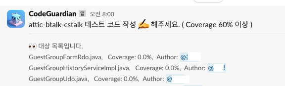

# Goal

- OKR 목표인 라인 커버리지 60%이상 유지
- 소나큐브 콘솔에 접속하지 않아도 커버리지를 확인할 수 있어야 한다.
- python 과 jenkins로 간단하고 빠르게 작업하기

# 기대효과

- 그 동안 스프린트 막바지에 숙제처럼 커버리지를 올리는 작업은 사라지길 기대~! 😃

# Plan

- 전날까지 수집된 소나큐브 커버리지 정보를  소나큐브 API를 통해 조회한다.
- condition
    - new code만을 대상으로 한다
    - 커버리지가 60% 이하인 클래스만을 대상으로 한다.
    - 커버되지 않은 라인이 10개 이상인 것
- 해당 코드 작성자에게 슬랙 멘션 알림

# 환경

- python 3.12+
- jenkins 2.414.1
- sonarqube 9.9.1
- slack_sdk

# 구현

<aside>
💡 전체 코드는 [https://github.com/tnfhrnsss/sonarqube_coverage_tracker](https://github.com/tnfhrnsss/sonarqube_coverage_tracker){:target="_blank"} 에 있습니다.

</aside>

## 1. 소나큐브 커버리지 조회

- measures API 호출
    - 주요 파라미터
        - metricSort, metricKeys : new_coverage
        - component : 프로젝트의 컴포넌트 아이디 설정으로 배열로 호출할 수 있다.
        
        ```bash
        http://localhost:9100/api/measures/component_tree?
        	additionalFields=metrics&
        	ps=500&
        	asc=true&
        	metricSort=new_coverage&
        	s=metricPeriod&
        	metricSortFilter=withMeasuresOnly&
        	metricPeriodSort=1&
        	component=" + componentKey + "&
        	metricKeys=new_coverage%2Cnew_uncovered_lines%2Cnew_uncovered_conditions&
        	strategy=leaves
        ```
        
- 탐지 조건에 맞는 데이터만 추출해서 key:value로 저장
- key를 기준으로 상세 sources/line API 호출
    - request
        
        ```bash
        http://localst:9100/api/sources/lines?
        	key=attic-btalk-cstalk:cstalk-component/bizformpublisher/bizformpublisher-service/src/main/java/spectra/attic/btalk/cstalk/bizformpublisher/request/adapter/local/AgentBizformRequestLocalAdapter.java
        ```
        
    - response
        
        ```bash
        {
          "line": 81,
          "code": "\u003cspan class\u003d\"a\"\u003e@\u003cspan class\u003d\"sym-5 sym\"\u003ePathVariable\u003c/span\u003e\u003c/span\u003e String \u003cspan class\u003d\"sym-45 sym\"\u003eknowledgeId\u003c/span\u003e",
          "scmRevision": "3d22bc366644cbbf87aa90f36bd44be2d6e80133",
          "scmAuthor": "tester@...",
          "scmDate": "2024-05-20T07:05:00+0900",
          "duplicated": false,
          "isNew": true
        }
        ```
        
    - 다시 데이터 정제작업
        - newcode가 10개 이상인 것
        - author정보 저장
    

## 2. 메시지 구성

- uncovered된 클래스명
- 현재 커버리지 %
- 코드 author 이름

## 3. slack api 호출

- slack_sdk 라이브러리 활용

# 이행

- 서버에 프로젝트 반영
- jenkins 설정
    - job으로 등록
    - pipe line 구성
        
        ```bash
        stage('SONARQUBE COVERAGE ALARM') {
            steps {
              sshPublisher(
                publishers: [
                  sshPublisherDesc(configName: 'cstalk-183', verbose: true,
                    transfers: [
                      sshTransfer(
                        execCommand:
                          """
                            cd /home/spectra/tools/util-sonarqube-coverage/src
                            python3 coverage.py
                          """
                      )
                    ]
                  )
                ]
              )
            }
          }
        ```
        

# output

