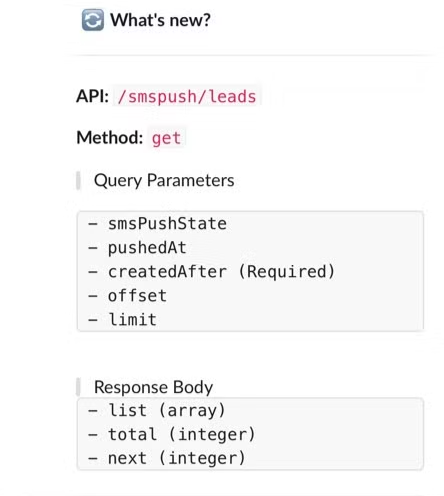
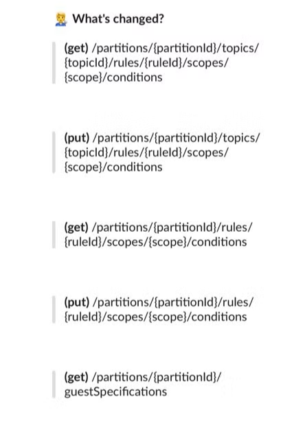
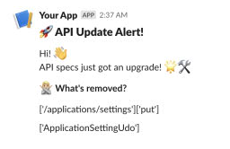

# 작업 배경

- frontend와 backend 개발자가 같이 작업하기 위해 API 변경내용을 공유하는 방법이 필요했다.
- 이미 제공되던 swagger-diff로는 **지속적인** 변경내용 추적을 하기 어려움
- 슬랙 알림을 통해 변경내용에 대한 모니터링 필요한 상황

# 환경 🏞️

- open api 3.0.x
- python 3.13 +
- 슬랙 workspace 및 bot 설정
- library install
    - deepdiff
    - slack_sdk
    - request
    - http
    - re
    - urllib
    - json
    - datetime

# 설계

- swagger를 통해 api docs를 제공하는 서비스의 v3/api-docs를 json으로 저장하고 주기적으로 변경한다.
- deepdiff 라이브러리를 통해 최근 api결과와 현재 api내용을 비교한다.
- 결과물은 {API_URL}_lastest_snapshot.json파일로 저장해서 지속적으로 비교할 수 있게 한다.

# 작업 내용

## 1. TO-BE API 문서와 AS-IS API 문서 가져오기

- 직전 API 문서 정보 위치
    - {HOME}\output\{API_URL}_lastest_snapshot.json
    - 처음 실행하거나 존재하지 않으면 diff 중지하고 현재 API 문서 내용을 lastest_snapshot.json 파일로 저장
- 현재 API 문서 정보 가져오기
    - {SWAGGER_URL}/v3/api-docs
        - ex. http://localhost:7777/v3/api-docs

## 2. 비교

- deepdiff.diff를 실행하면 아래 항목으로 결과가 도출된다.
    - 아래 항목 중 알림 대상으로 한 것은 아래 3가지로 제한했다.
        - dictionary_item_added
        - dictionary_item_removed
        - values_changed

```bash
dictionary_item_added:

설명: swagger_new에는 있지만 swagger_old에는 없는 항목.
형태: {'root['new_key']': 'new_value'}
dictionary_item_removed:

설명: swagger_old에는 있지만 swagger_new에는 없는 항목.
형태: {'root['old_key']': 'old_value'}
values_changed:

설명: 동일한 키를 가지지만, 값이 서로 다른 경우.
형태: {'root['some_key']': {'old_value': 'old', 'new_value': 'new'}}
type_changes:

설명: 값의 데이터 타입이 변경된 경우.
형태: {'root['some_key']': {'old_type': int, 'new_type': str, 'old_value': 1, 'new_value': '1'}}
iterable_item_added:

설명: 리스트나 튜플 등의 반복 가능한 객체에서 새로 추가된 항목.
형태: {'root[0]': 'new_item'}
iterable_item_removed:

설명: 리스트나 튜플에서 제거된 항목.
형태: {'root[0]': 'old_item'}
attribute_added:

설명: 객체에 새로 추가된 속성.
형태: {'root.some_attribute': 'new_value'}
attribute_removed:

설명: 객체에서 제거된 속성.
형태: {'root.some_attribute': 'old_value'}
```

- api diff 결과 예시
    
    ```bash
    "{
    \"dictionary_item_added\": 
    	[
    		\"root['paths']['/tGifts']\", 
    		\"root['components']['schemas']['TGiftRdo']\", 
    		\"root['components']['schemas']['TGiftRdoListRdo']\"
    	], 
    \"values_changed\": 
    	{
    		\"root['servers'][0]['url']\": 
    			{\"new_value\": \"https://local.co.kr\", 
    			\"old_value\": \"https://local.co.kr/\"}, 
    		\"root['paths']['/products']['get']['operationId']\": 
    			{\"new_value\": \"findProductList_1\", 
    			\"old_value\": \"findProductList\"}, 
    		\"root['paths']['/products/productSaleInfos']['get']['parameters'][3]['name']\": 
    			{\"new_value\": \"subcomm\", 
    			\"old_value\": \"subComm\"}}
    	}"
    ```
    

## 3. 메시지 구성

- deepdiff의 extract와 같은 메서드를 활용해서 유연하게 파싱하고 싶었지만, 값을 추출하는 것에 한계가 있었다. 😭

### (1) extract or search

- match 함수로는 유연하게 대처가 안되기 때문에
- deepdiff의 extract와 search를 사용하려고 했는데.
- 내가 원하는 것은 root['paths']['/applications/settings']['put'] 에서 '/applications/settings'와 put이였지만 두개의 메소드를 사용해도 str 타입이기 떄문에 결국 match를 사용할 수 밖에 없었다.

### (2) 템플릿 메시지

- 가독성있게 구성하기 위해 데이터별로 메시지를 템플릿화했다.

## 4. Slack API 호출

- {HOME}\config\env.json 에 슬랙 채널 정보 및 토큰을 설정한다.
- 최종적으로 모아진 메시지를 슬랙으로 전송한다.

## 5. 자동화 구성

- jenkins를 통해 프로젝트 build job 실행 후
- swagger-diff job이 실행되도록 구성했다.
- pipeline
    
    ```bash
    pipeline {
      agent any
    
      stages {
        stage('Trigger CCC Build') {
            steps {
                script {
                    build job: 'build-ccc/develop', wait: true,
                    parameters: [
                      string(name: 'RUNTYPE', value: 'all')
                    ]
                }
            }
        }
        stage('Restart CCC') {
            steps {
                script {
                    build job: 'modeloffice-part',
                      wait: true,
                      parameters: [
                        string(name: 'MODULE', value: 'ccc'),
                        string(name: 'ACTION', value: 'restart')
                      ]
                }
            }
        }
        stage('Wait until service UP') {
            steps {
                script {
                    echo 'Waiting for 3 minutes...'
                    sleep(time: 3, unit: 'MINUTES')
                }
            }
        }
        stage('Detect Api Change') {
            steps {
                sshPublisher(
                  publishers: [
                    sshPublisherDesc(configName: 'dev', verbose: true,
                      transfers: [
                        sshTransfer(
                          execCommand:
                            """
                              cd /home/swagger-diff-notify/src
                              python3 main.py https://localhost.co.kr
                            """
                        )
                      ]
                    )
                  ]
                )
            }
        }
      }
    }
    ```
    

# Output

- add
    
    
    
- changed
    
    
    
- remove



# Github
- [swagger-diff-notify](https://github.com/tnfhrnsss/swagger-diff-notify){:target="_blank"}  

# Reference

- [zepworks-diff](https://zepworks.com/deepdiff/current/diff.html){:target="_blank"}  